# CoS Platform — Architecture Diagrams

Companion to `architecture.md`. All diagrams are derived from the decisions recorded there and supersede the diagrams in `initial_docs/shared_cos_platform_diagrams_and_handoff.md`.

---

## 1. System Context (C4 Level 1)

### Phase 1 — Builder Validation

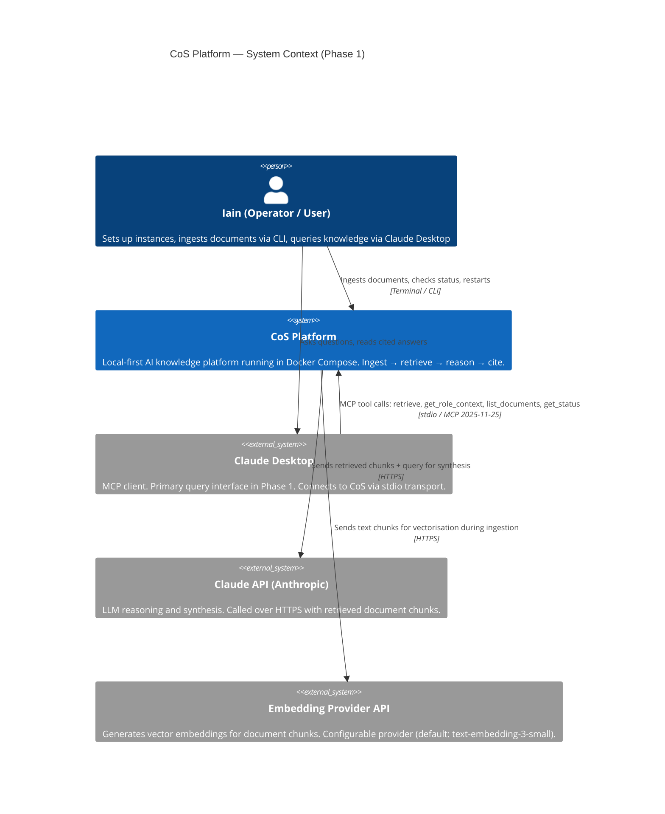

### Phase 2 — First Real Users (Growth tier additions)

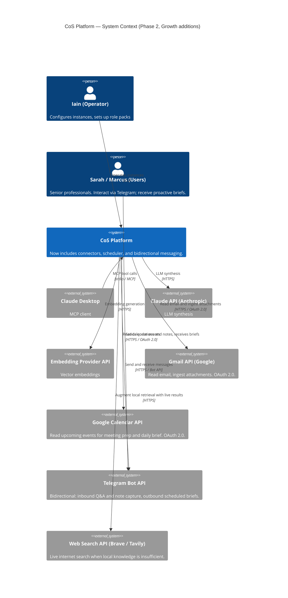

---

## 2. Container Diagram (C4 Level 2)

### Phase 1 — Docker Compose services

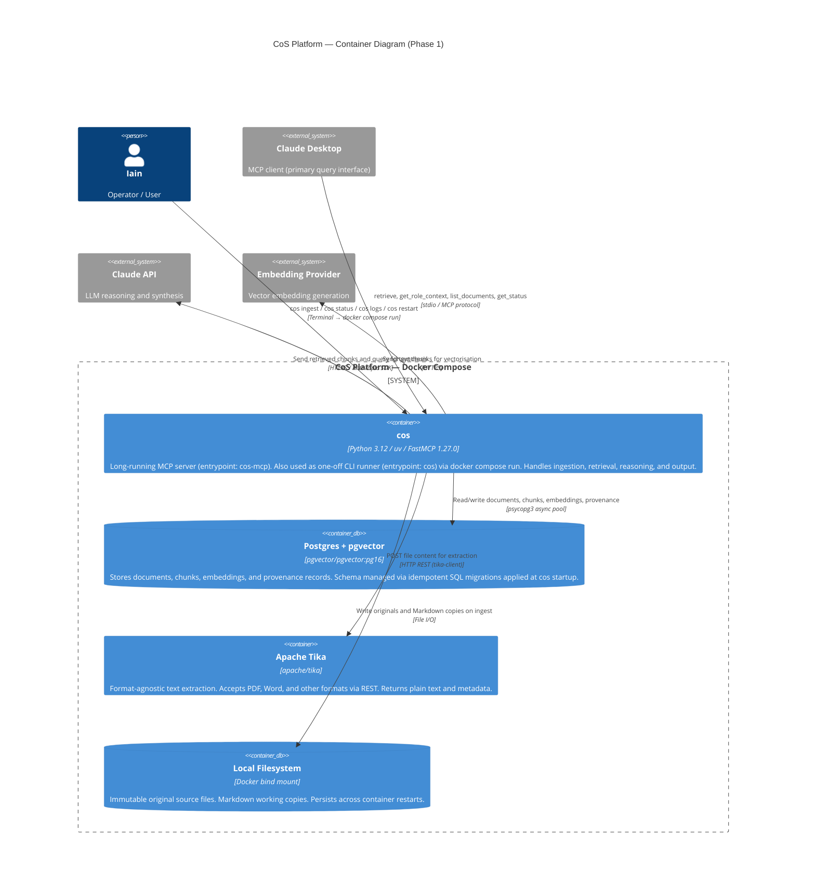

### Phase 2 — Container additions

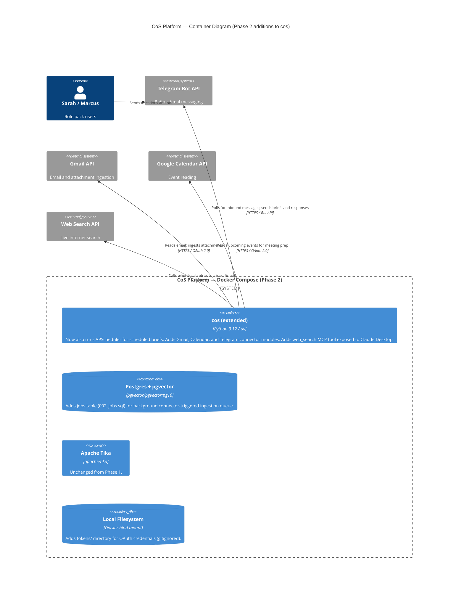

---

## 3. Component Diagram (C4 Level 3) — `cos` container internals

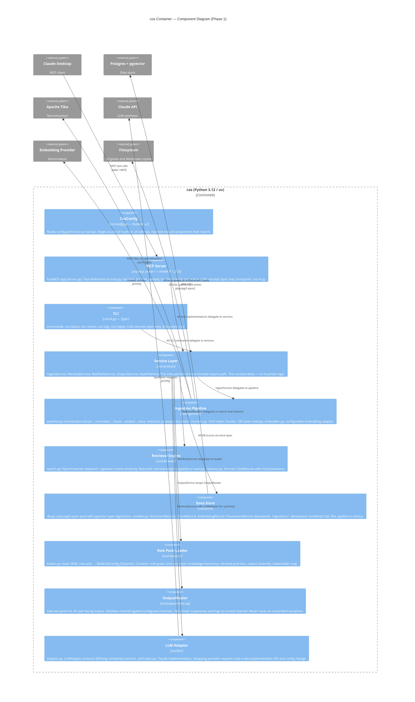

---

## 4. Dynamic Flows

### 4.1 Ingestion — New Document (Phase 1)

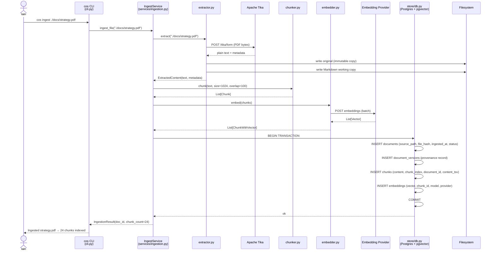

### 4.2 Query — MCP Retrieve Tool (Phase 1)

### 4.3 Platform Startup Sequence

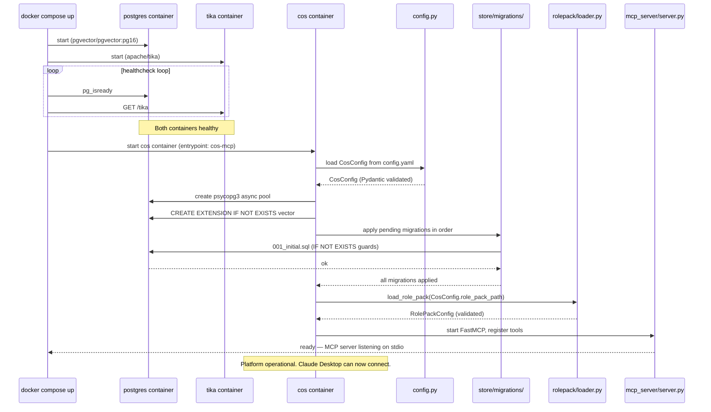

### 4.4 Scheduled Morning Brief (Phase 2)

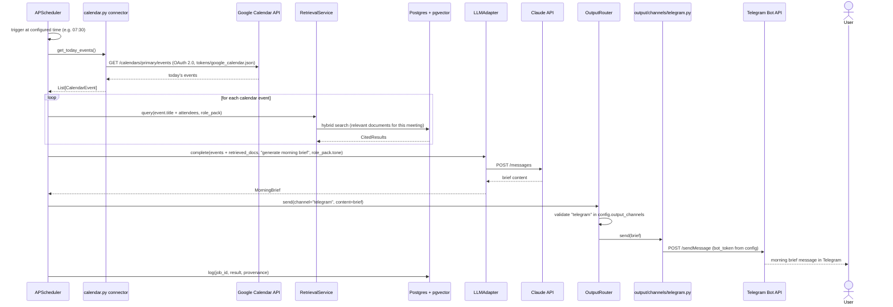

### 4.5 Inbound Telegram Message — Q&A or Note Capture (Phase 2)

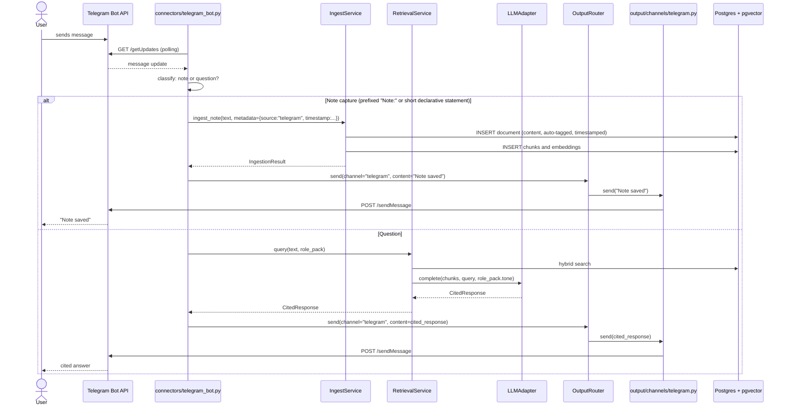

---

## 5. Data Model

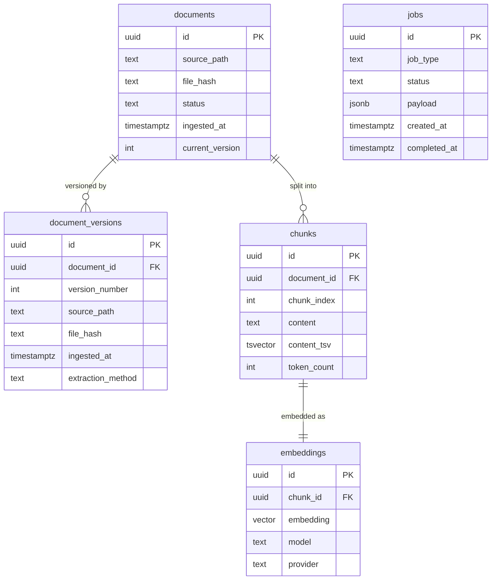

`jobs` table is Phase 2. All other tables are Phase 1 MVP.

Citation integrity: every `embeddings` row → `chunks` row → `documents` row → original file on filesystem. No answer can be returned without this chain being intact.

---

## 6. Phase Evolution — What Gets Added When

```mermaid
flowchart LR
    subgraph P1["Phase 1 — Builder Validation"]
        direction TB
        MCP1["MCP Server\n(FastMCP)"]
        CLI1["CLI\n(Typer)"]
        ING1["Ingestion Pipeline\n(Tika + pgvector)"]
        RET1["Retrieval Engine\n(hybrid search)"]
        DB1[("Postgres\n+ pgvector")]
        LLM1["LLM Adapter\n(Claude)"]
        RP1["Role Pack Loader\n(CHRO config)"]
        OR1["OutputRouter\n(local channel)"]
    end

    subgraph P2["Phase 2 — First Real Users"]
        direction TB
        SCH2["APScheduler\n(daily brief)"]
        BOT2["Telegram Bot\n(bidirectional)"]
        GMAIL2["Gmail Connector\n(ingest email)"]
        CAL2["Calendar Connector\n(meeting prep)"]
        WEB2["Web Search Tool\n(MCP tool)"]
        JOBS2[("jobs table\n(Phase 2 schema)")]
        TG2["Telegram Channel\n(OutputRouter)"]
    end

    subgraph P3["Phase 3 — Governance & Write-back"]
        direction TB
        GOV3["Governance Layer\n(audit, confidence)"]
        WB3["Write-back Actions\n(approval step)"]
        MULTI3["Multi-provider\nLLM support"]
    end

    P1 --> P2 --> P3
```

---

## 7. OutputRouter — Egress Control Logic

The OutputRouter is the single enforcement point for NFR7 (fail-closed egress). This diagram shows its decision logic.

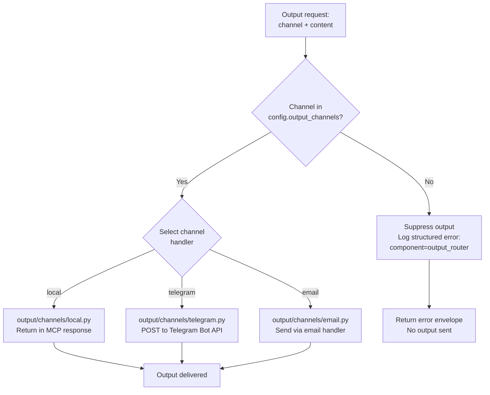