# CoS Platform — Architecture Diagrams

Companion to `architecture.md`. All diagrams are derived from the decisions recorded there and supersede the diagrams in `initial_docs/shared_cos_platform_diagrams_and_handoff.md`.

---

## 1. System Context (C4 Level 1)

### Phase 1 — Builder Validation

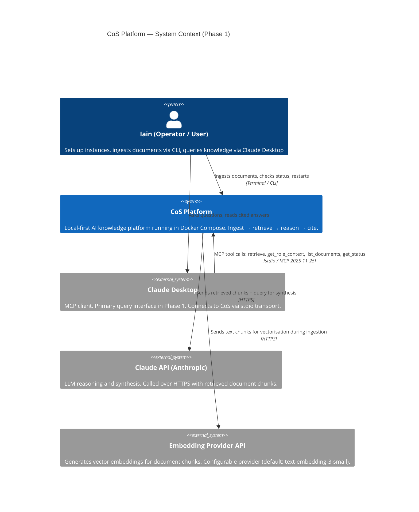

### Growth Roadmap End-State (sequenced delivery after Epic 6)

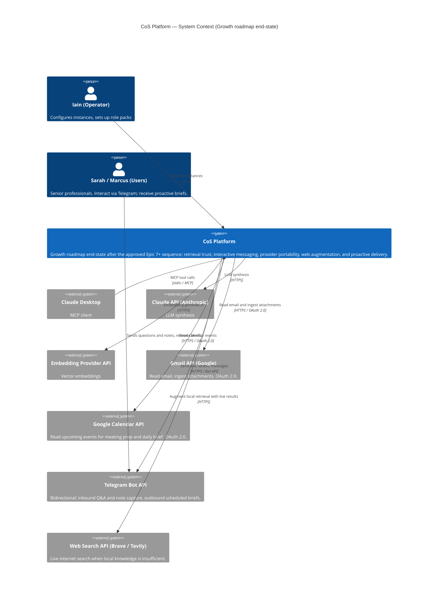

---

## 2. Container Diagram (C4 Level 2)

### Phase 1 — Docker Compose services

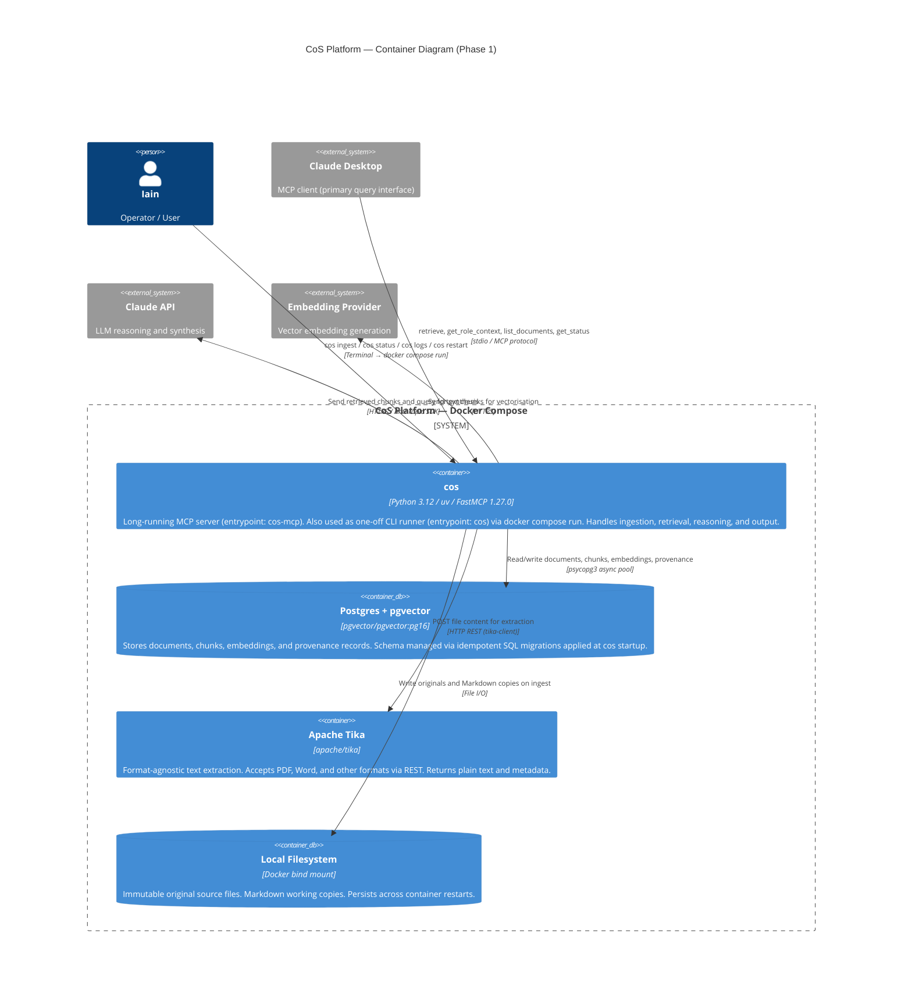

### Growth Roadmap End-State — Container additions on top of the baseline

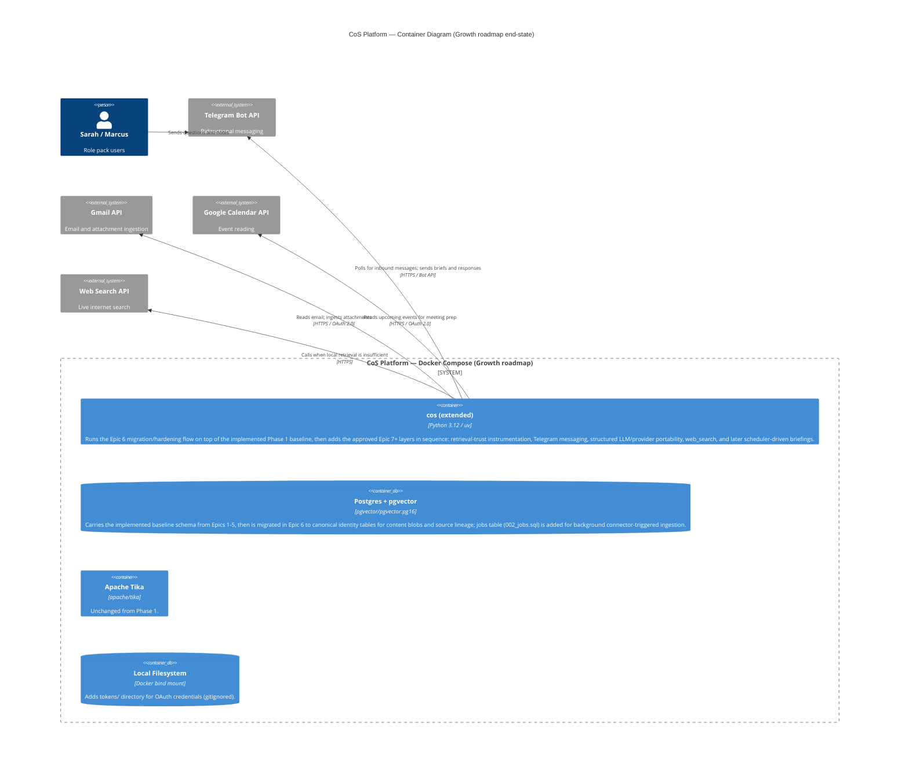

---

## 3. Component Diagram (C4 Level 3) — `cos` container internals

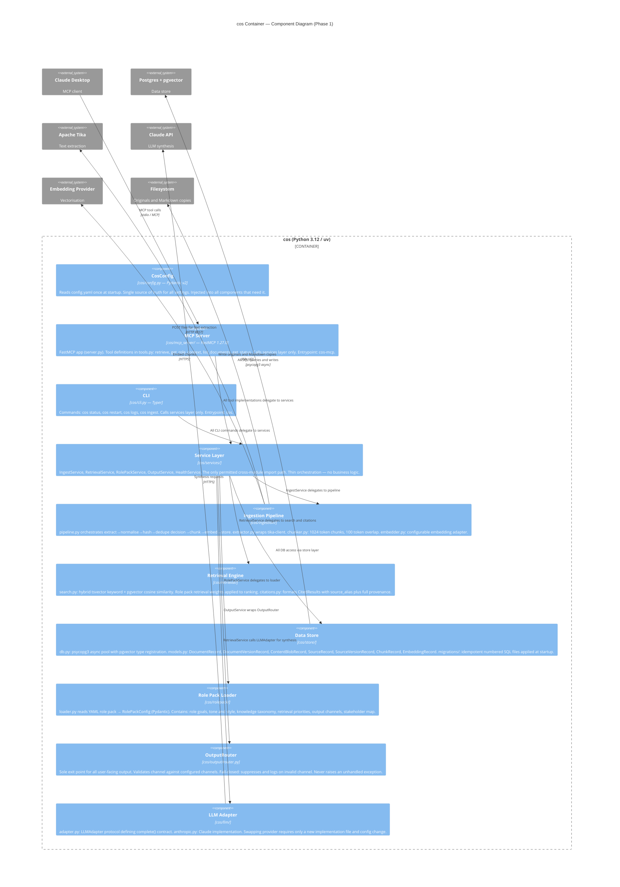

---

## 4. Dynamic Flows

### 4.1 Ingestion — Canonical Ingest Decision (Identity-Hardened Flow)

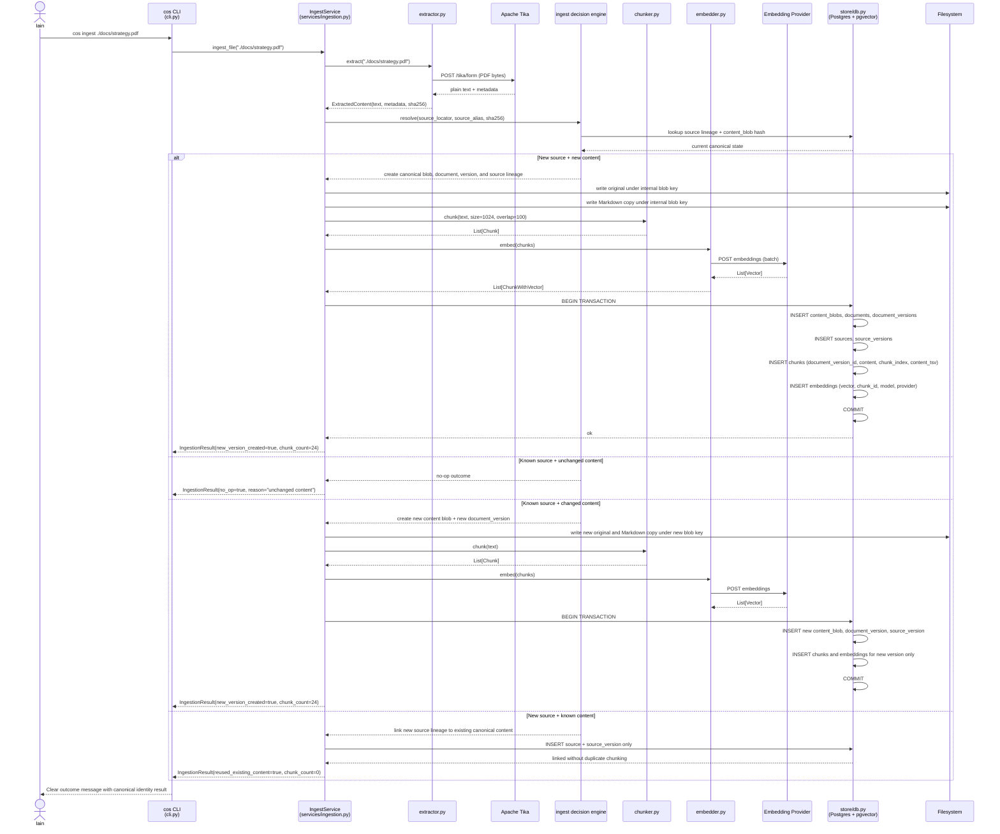

### 4.2 Query — MCP Retrieve Tool (Phase 1)

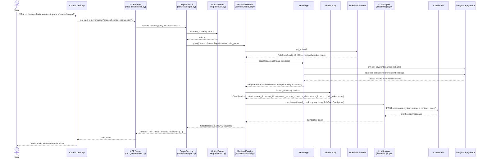

### 4.3 Platform Startup Sequence

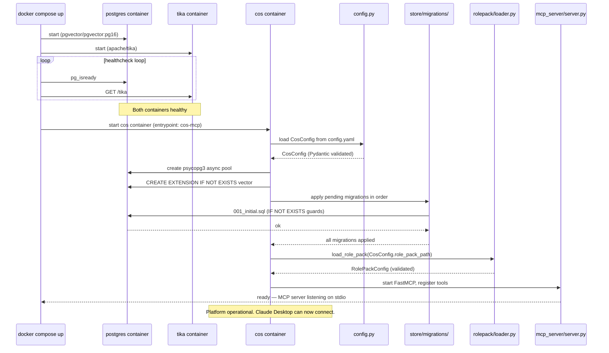

### 4.4 Scheduled Morning Brief (Epic 11)

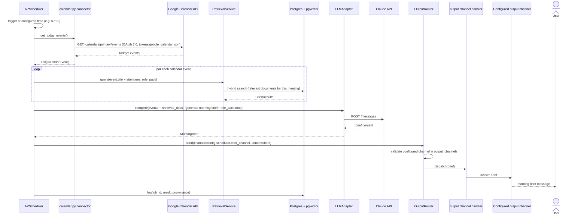

### 4.5 Inbound Telegram Message — Q&A or Note Capture (Epic 8)

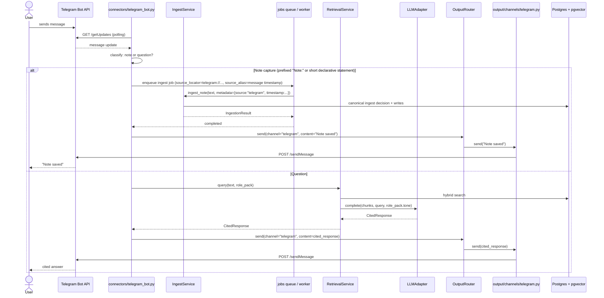

---

## 5. Data Model

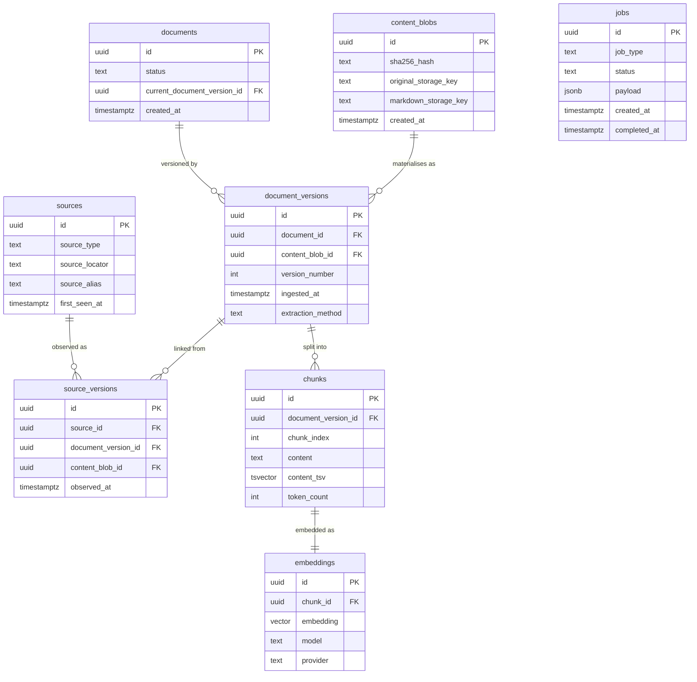

`jobs` table is Phase 2. The canonical identity tables (`content_blobs`, `sources`, `source_versions`) are the identity-hardening foundation that must land before connector expansion.

Citation integrity: every `embeddings` row → `chunks` row → `document_versions` row → `content_blobs` and `source_versions` → `sources` → managed original/Markdown copies. User-facing citations use `source_alias`; raw locators remain available for traceability.

---

## 6. Phase Evolution — What Gets Added When

```mermaid
flowchart LR
    subgraph P1["Phase 1 — Builder Validation"]
        direction TB
        MCP1["MCP Server\n(FastMCP)"]
        CLI1["CLI\n(Typer)"]
        ING1["Ingestion Pipeline\n(Tika + pgvector)"]
        RET1["Retrieval Engine\n(hybrid search)"]
        DB1[("Postgres\n+ pgvector")]
        LLM1["LLM Adapter\n(Claude)"]
        RP1["Role Pack Loader\n(CHRO config)"]
        OR1["OutputRouter\n(local channel)"]
    end

    subgraph P2["Approved Growth Sequence — Epics 7-11"]
        direction TB
        E7["Epic 7\nRetrieval trust + eval + observability"]
        E8["Epic 8\nInteractive Telegram messaging"]
        E9["Epic 9\nStructured LLM boundary + provider portability"]
        E10["Epic 10\nWeb augmentation"]
        E11["Epic 11\nProactive briefings + meeting prep"]
        JOBS2[("jobs table\n(background work substrate)")]
        TG2["Telegram Channel\n(OutputRouter)"]
    end

    subgraph P3["Later Roadmap — Epics 12-14"]
        direction TB
        E12["Epic 12\nAgent-safe task runtime"]
        E13["Epic 13\nModel routing + local endpoints"]
        E14["Epic 14\nAdvanced retrieval + orchestration pilots"]
    end

    P1 --> P2 --> P3
    E7 --> E8 --> E9 --> E10 --> E11
    E11 --> E12
    E12 --> E13 --> E14
    JOBS2 --> E8
    JOBS2 --> E11
```

---

## 7. Epic 7 — Benchmark / Release-Gate Flow

Epic 7 is the retrieval-trust gate that must pass before Epic 8 (Telegram) or any later growth work begins. The diagram below shows the operator benchmark execution flow and how the release gate is evaluated.

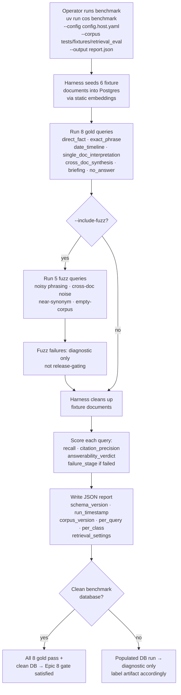

### Retrieval-Trust Sequencing

Epic 7 hardening is the prerequisite for all amplification layers:

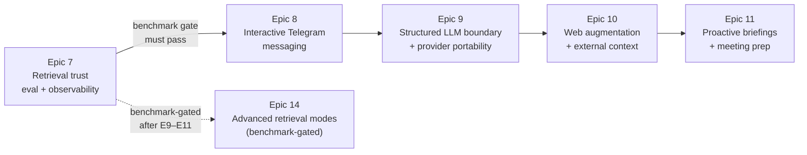

Epic 7 must land before Telegram messaging, web augmentation, and proactive scheduling. Advanced retrieval modes (Epic 14) are explicitly benchmark-gated and come after the full growth sequence.

---

## 8. OutputRouter — Egress Control Logic

The OutputRouter is the single enforcement point for NFR7 (fail-closed egress). This diagram shows its decision logic.

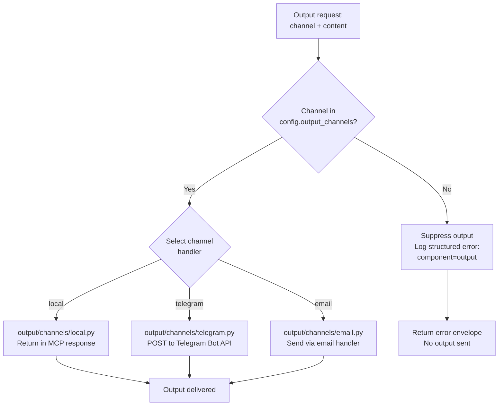
