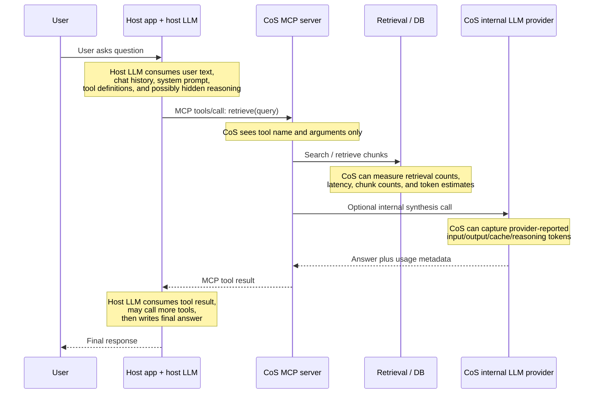
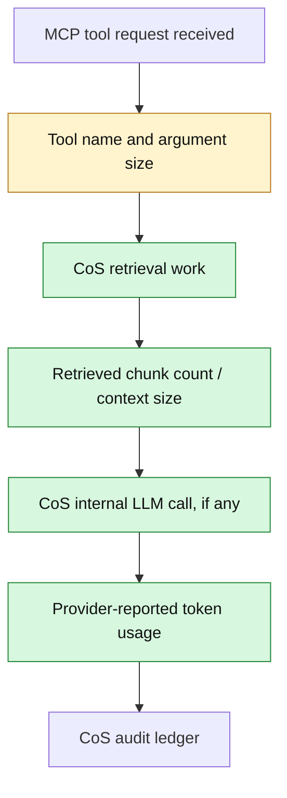
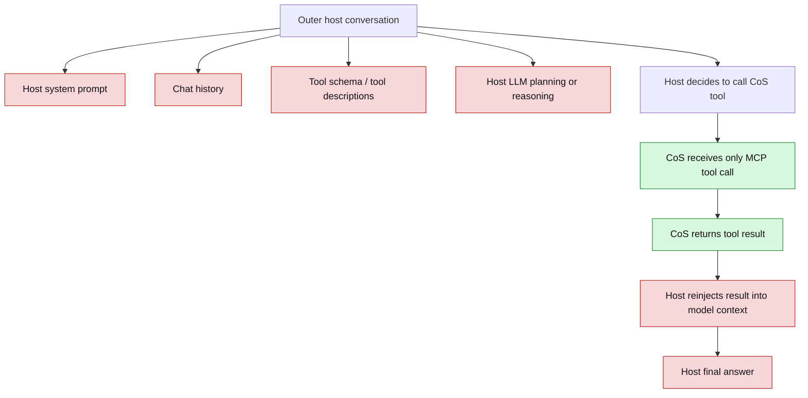
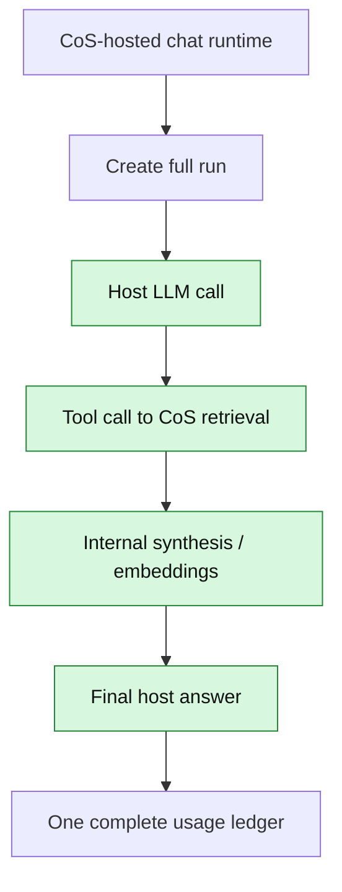
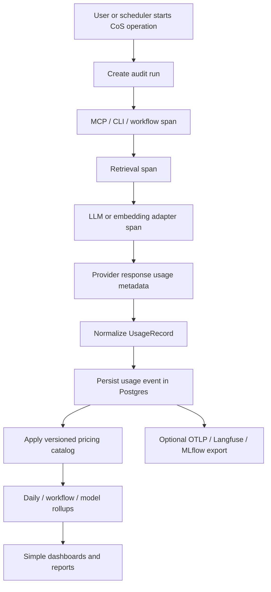

# CoS Token Monitoring and Cost Audit Options

Date: 2026-05-27  
Author: Codex technical research pass  
Status: Options paper for follow-on architecture design  
Recommended next step: approve an option, then create a focused architecture design and BMAD epic

## Executive Summary

Yes: the first phase should be an options paper.

Token monitoring and cost auditability touches the LLM adapter boundary, MCP tool execution, retrieval observability, database schema, dashboards, and governance. It is also easy to overbuild. The right first decision is whether CoS should own its usage ledger, outsource the problem to an LLM observability platform, or route everything through a gateway.

The recommendation is:

> Build a CoS-owned token audit ledger in Postgres, using OpenTelemetry GenAI semantic conventions as the naming vocabulary, with optional export to OpenTelemetry/Langfuse/MLflow later.

This gives CoS durable per-query and per-step attribution while preserving the platform's existing principles:

- provider choice remains interchangeable
- source truth and generated output stay separate
- sensitive prompt/source content is not logged
- dashboards can be simple SQL/materialized-view reports
- external observability tools stay optional rather than becoming the system of record

The recommended design should track usage at two levels:

1. **Run level**: one user-facing query, scheduled workflow, CLI action, or connector job.
2. **Span/event level**: each child operation that contributes to the run, such as MCP tool calls, retrieval, LLM inference, embedding calls, retries, and output delivery.

The core principle:

> Store provider-reported token usage as the source of truth whenever available. Use local tokenizer estimates only as fallback metadata, never as definitive billing truth.

The most important boundary is MCP:

> CoS can measure its own MCP tool execution, retrieval, and internal LLM calls. It generally cannot see the outer host model's hidden prompt, tool schema injection, tool result reinjection, or final answer token usage unless that host exposes those details. The audit model must make this explicit.

## Research Inputs

Local project context reviewed:

- `initial_docs/shared_cos_platform_architecture.md`
- `_bmad-output/planning-artifacts/architecture.md`
- `_bmad-output/planning-artifacts/research/cos-llm-routing-and-local-model-options-2026-05-15.md`
- `_bmad-output/planning-artifacts/research/cos-agentic-orchestration-options-2026-05-15.md`
- `_bmad-output/implementation-artifacts/7-2-retrieval-observability-and-structured-eval-logging.md`
- `src/cos/services/retrieval.py`
- `src/cos/retrieval/telemetry.py`
- `src/cos/llm/adapter.py`
- `src/cos/llm/anthropic.py`
- `src/cos/ingestion/embedder.py`
- `src/cos/mcp_server/tools.py`

External sources reviewed:

- [OpenTelemetry GenAI semantic conventions](https://opentelemetry.io/docs/specs/semconv/gen-ai/)
- [OpenTelemetry GenAI client spans](https://opentelemetry.io/docs/specs/semconv/gen-ai/gen-ai-spans/)
- [OpenTelemetry GenAI metrics](https://opentelemetry.io/docs/specs/semconv/gen-ai/gen-ai-metrics/)
- [OpenAI Responses API reference](https://platform.openai.com/docs/api-reference/responses/create?api-mode=responses)
- [OpenAI prompt caching guide](https://platform.openai.com/docs/guides/prompt-caching/overview)
- [OpenAI reasoning guide](https://platform.openai.com/docs/guides/Reasoning?api-mode=response)
- [Anthropic Messages API reference](https://docs.anthropic.com/en/api/messages)
- [Anthropic prompt caching guide](https://docs.anthropic.com/en/docs/build-with-claude/prompt-caching)
- [Anthropic token counting guide](https://docs.anthropic.com/en/docs/build-with-claude/token-counting)
- [Google Gemini token counting guide](https://ai.google.dev/gemini-api/docs/tokens)
- [Google Vertex AI GenerateContentResponse usage metadata](https://docs.cloud.google.com/vertex-ai/generative-ai/docs/reference/rest/v1/GenerateContentResponse)
- [MCP 2025-11-25 basic specification](https://modelcontextprotocol.io/specification/2025-11-25/basic)
- [MCP schema reference](https://modelcontextprotocol.io/specification/2025-06-18/schema)
- [Langfuse token and cost tracking](https://langfuse.com/docs/observability/features/token-and-cost-tracking)
- [Helicone cost tracking guide](https://docs.helicone.ai/guides)
- [LiteLLM getting started and observability docs](https://docs.litellm.ai/)
- [MLflow OpenTelemetry integration](https://mlflow.org/docs/latest/genai/tracing/opentelemetry/)
- [MLflow token usage and cost tracking](https://mlflow.org/docs/latest/genai/tracing/token-usage-cost/)

## Current CoS Context

CoS already has useful foundations:

- provider/model are configured in `config.yaml`
- LLM access is isolated behind `LLMAdapter`
- retrieval runs now emit structured JSON telemetry with trace ids, provider/model, latency, candidate counts, and success/degraded outcomes
- chunk records already have a `token_count` field
- embeddings store provider/model
- Postgres is the canonical store
- governance guidance already forbids raw prompt text, raw query text, chunk content, secrets, OAuth tokens, and DSNs in telemetry

Current limitations:

- `LLMAdapter.complete(prompt, context) -> str` discards provider usage metadata
- Anthropic response `message.usage` is not captured
- no persistent usage ledger exists
- structured retrieval telemetry is log-only, not queryable via DB
- no cost estimation model or pricing catalog exists
- MCP tool calls are not model-token-attributed beyond the internal retrieval/synthesis path
- embeddings and future provider calls are not unified under one audit schema

This means CoS is close to being observable, but not yet accountable.

## Problem Statement

The platform needs to answer operator questions such as:

- How many tokens did a single user question consume end to end?
- Which steps consumed those tokens?
- Was the cost caused by retrieval context size, synthesis output, retries, embeddings, prompt caching misses, tool outputs, or model choice?
- Which workflows are the top token users over the last day/week/month?
- Did a change in retrieval strategy increase prompt size?
- Did a model/provider switch reduce or increase cost?
- Are cached input tokens being used effectively?
- Which runs exceeded expected token budgets?
- Can we produce a simple cost report from the local database?

The design should support simple dashboards first, not a heavy analytics platform.

## What Must Be Tracked

### Run-Level Facts

A run is the top-level unit an operator cares about.

Examples:

- one MCP `retrieve` call
- one CLI ingest command
- one scheduled daily briefing
- one Telegram message flow
- one future long-running task

Useful run fields:

- `run_id`
- `trace_id`
- `started_at`
- `ended_at`
- `status`
- `surface`: `mcp`, `cli`, `scheduler`, `telegram`, `worker`, `api`
- `workflow_name`: `retrieve`, `daily_calendar_check`, `ingest_document`, etc.
- `role_pack_name`
- `actor_type`: `human`, `system`, `connector`, `agent`
- `actor_id_hash`, if needed
- `query_fingerprint`, if needed
- `total_input_tokens`
- `total_output_tokens`
- `total_cached_input_tokens`
- `total_reasoning_output_tokens`
- `estimated_cost_usd`
- `cost_quality`: `provider_reported`, `price_catalog_estimated`, `token_estimated`, `unknown`

Raw user text should not be stored in this ledger by default.

### Span/Event-Level Facts

A span is a child operation inside a run.

Examples:

- MCP tool call received
- retrieval search
- context expansion
- LLM synthesis call
- embedding batch call
- connector API fetch
- retry
- output delivery

Useful span fields:

- `span_id`
- `parent_span_id`
- `run_id`
- `trace_id`
- `operation_type`: `mcp_tool_call`, `retrieval`, `llm_inference`, `embedding`, `connector`, `output`, `scheduler`, `cost_calculation`
- `operation_name`
- `started_at`
- `ended_at`
- `latency_ms`
- `status`
- `failure_stage`
- `provider`
- `model`
- `request_model`
- `response_model`
- `input_tokens`
- `output_tokens`
- `total_tokens`
- `cached_input_tokens`
- `cache_creation_input_tokens`
- `cache_read_input_tokens`
- `reasoning_output_tokens`
- `tool_use_prompt_tokens`
- `embedding_input_tokens`
- `usage_details_json`
- `provider_usage_json`
- `usage_source`: `provider_reported`, `provider_count_tokens`, `local_estimate`, `not_applicable`, `unknown`
- `cost_details_json`
- `estimated_cost_usd`
- `pricing_catalog_version`
- `retry_of_span_id`

The JSON fields are important because provider token schemas evolve faster than database schemas.

### MCP-Specific Facts

For MCP tool calls, CoS should track:

- tool name
- input argument byte size
- input argument approximate token count, if locally estimated
- output payload byte size
- output payload approximate token count, if locally estimated
- internal CoS work triggered by the tool
- whether the tool response included citations
- whether the tool call caused internal LLM synthesis

But CoS should not pretend it knows:

- host-side system prompt tokens
- host-side tool schema tokens
- the host model's selection/planning tokens
- tokens consumed when the host re-injects the MCP tool result into its own model context
- the host model's final answer tokens

Those can only be captured if the host model runtime provides usage metadata or if CoS later operates as the host/client itself.

### MCP Visibility Boundary

This boundary matters because an MCP server is not the whole chat runtime. CoS is a tool server being called by an outer host such as Claude Desktop, ChatGPT, or an agent runtime. That host has its own model conversation, system prompt, chat history, tool schemas, planning/reasoning, and final answer. CoS only sees the MCP request it receives and the work it performs internally.

What CoS can monitor accurately:

CoS can know these well:

- MCP tool name, arguments, timing, and status
- approximate token/byte size of query arguments it received
- retrieval strategy, candidate counts, final evidence count, and expanded context count
- chunk counts and stored chunk token counts
- internal LLM calls that CoS itself makes
- provider-reported usage for internal calls, if the adapter captures it
- CoS-side estimated cost for those internal calls

What CoS cannot monitor accurately from inside an MCP server:

CoS generally cannot know:

- the host model's full prompt size
- how many tokens the host spent reading tool definitions
- how many tokens the host spent deciding to call CoS
- hidden reasoning/thinking tokens in the host model
- how many tokens the host spent reading CoS's tool result
- tokens used by follow-up host tool calls outside CoS
- final answer output tokens from the host model

So if a user asks Claude Desktop a question and Claude calls CoS, the real total token use may look like this:

```mermaid
flowchart LR
    A["Host prompt tokens<br/>not visible to CoS"]:::unknown
    B["Host tool-selection tokens<br/>not visible to CoS"]:::unknown
    C["MCP request args<br/>visible, estimate only"]:::partial
    D["CoS retrieval<br/>visible"]:::known
    E["CoS internal LLM call<br/>visible if provider reports usage"]:::known
    F["MCP result size<br/>visible, estimate only"]:::partial
    G["Host consumes tool result<br/>not visible to CoS"]:::unknown
    H["Host final answer tokens<br/>not visible to CoS"]:::unknown

    A --> B --> C --> D --> E --> F --> G --> H

    classDef known fill:#d7f7df,stroke:#238636,color:#111;
    classDef partial fill:#fff4ce,stroke:#b7791f,color:#111;
    classDef unknown fill:#f8d7da,stroke:#b42318,color:#111;
```

The design implication is:

> CoS should report CoS-attributable usage, not pretend to know whole-conversation usage.

Good dashboard/report labels would be:

- `cos_internal_tokens`: accurate from provider usage
- `mcp_payload_estimated_tokens`: approximate size of MCP tool input/output payloads
- `host_tokens`: unknown unless host telemetry is provided
- `total_known_cost`: CoS-owned provider calls only
- `total_estimated_end_to_end_cost`: only available if host usage metadata is integrated

If CoS later becomes the host itself, or receives usage metadata from the host, then the boundary changes:

In that future shape, CoS controls the outer model call too, so it can capture the whole token story. While CoS is only an MCP server, it can precisely audit the work it owns and only estimate or leave blank the host-side model spend.

## External Research Findings

### 1. Provider APIs Expose Usage, But Not in One Shape

OpenAI, Anthropic, and Gemini all expose token usage metadata, but with different field names and details.

OpenAI exposes input, output, total, cached input, and reasoning token details in modern response usage objects. The prompt caching guide documents `cached_tokens`, and the reasoning guide documents reasoning tokens under output token details.

Anthropic exposes usage on Messages responses and prompt caching fields such as input, output, cache creation input, and cache read input tokens. Anthropic also provides a count-tokens endpoint for preflight estimation, but notes that actual message usage may differ.

Gemini exposes `usageMetadata`, including prompt tokens, candidate/output tokens, total tokens, and for supported cases, thinking/tool-use related counts. Gemini streaming usage metadata appears on the final stream chunk.

Conclusion:

> A provider-agnostic design must normalize common fields while preserving provider-specific usage details.

### 2. Token Counts Are Not Enough for Cost

Cost depends on usage type, provider, model, pricing tier, cache status, batch mode, modality, context length, and sometimes reasoning/thinking tokens.

Examples:

- cached input may be priced differently from normal input
- cache writes may have a distinct price from cache reads
- output tokens are often priced differently from input tokens
- reasoning/thinking tokens may be billed as output tokens
- long-context thresholds can change prices
- explicit context caching may incur storage/time charges

Conclusion:

> Store token facts separately from cost calculations. Cost should be derived from a versioned pricing catalog and should retain the catalog version used.

### 3. OpenTelemetry Is the Best Vocabulary, But Not Yet a Complete Product Decision

OpenTelemetry's GenAI semantic conventions define attributes and metrics for generative AI spans, including input/output token usage, cache tokens, reasoning tokens, model request/response fields, retrievals, embeddings, and tool execution. The conventions are still marked as development.

That status matters. CoS should not couple its database migrations too tightly to a moving specification.

Conclusion:

> Use OpenTelemetry GenAI names as the external/export vocabulary and naming inspiration, but own a stable CoS internal schema with a recorded `semconv_version`.

### 4. Observability Products Can Help, But Should Not Own CoS Truth Yet

Langfuse supports token and cost tracking for LLM generations and embeddings, including custom usage details and custom model pricing definitions. It can infer some costs, but its own docs recommend providing provider usage for reasoning models because inference can miss hidden reasoning tokens.

Helicone provides cost analytics, alerts, reports, and gateway-based visibility. Its docs distinguish accurate gateway-based cost calculation from best-effort direct integration.

MLflow now supports token usage and cost tracking in traces and can ingest/export OpenTelemetry GenAI convention traces.

Conclusion:

> These systems are strong optional sinks or future dashboards, but CoS still needs a first-party usage record if auditability and local-first operation matter.

### 5. Gateways Are Powerful, But They Change the Architecture

LiteLLM offers a unified OpenAI-compatible interface over many providers, observability callbacks, response cost metadata, a proxy server, virtual keys, budgets, rate limits, and spend tracking by project/user. Helicone's gateway offers accurate request visibility and cost tracking.

That is useful, especially for enforcement and multi-provider operations. But making a gateway primary would put routing, credentials, budgeting, and failure behavior in an external component before CoS has finalized its structured LLM boundary.

Conclusion:

> Gateways are attractive later for centralized budget enforcement, but they should not be the first token audit architecture for CoS.

## Option Space

## Option 0: Provider Dashboards Only

Use OpenAI/Anthropic/Gemini dashboards and invoices to monitor costs.

Advantages:

- no implementation work
- official billing source
- useful monthly reconciliation

Disadvantages:

- no per-query attribution
- no CoS workflow/tool breakdown
- no link to retrieval context size
- no local dashboard
- no way to identify high-token internal steps
- provider-specific and fragmented

Assessment:

This is insufficient for the stated goal. It can remain a reconciliation backstop, not the operating model.

## Option 1: CoS-Owned Token Audit Ledger With OpenTelemetry-Aligned Schema

CoS records run/span usage events into Postgres. LLM/embedding adapters normalize provider usage metadata into a common `UsageRecord`. The ledger uses OpenTelemetry GenAI naming conventions where practical and keeps provider-specific details in JSONB.

Advantages:

- best fit with current local-first architecture
- provider-agnostic without hiding provider details
- durable and queryable with simple SQL
- supports BMAD story generation cleanly
- can join to role pack, workflow, retrieval mode, source/citation counts, and status
- works before any external dashboard is chosen
- can later export to OpenTelemetry, Langfuse, MLflow, Grafana, or CSV

Disadvantages:

- CoS must implement schema, instrumentation, pricing catalog, and reports
- not a polished observability UI by default
- cost estimates need maintenance as provider pricing changes
- usage capture requires adapter contract changes

Assessment:

This is the recommended option.

## Option 2: OpenTelemetry Collector and Trace Backend as the Primary Store

Instrument CoS with OpenTelemetry spans and metrics, export to an OTLP collector, and store in a trace/metrics backend.

Advantages:

- vendor-neutral telemetry standard
- strong trace model for per-query and per-step breakdown
- can integrate with Grafana/Tempo, Datadog, Honeycomb, MLflow, etc.
- aligns with emerging GenAI conventions

Disadvantages:

- more operational moving parts
- GenAI conventions are still evolving
- trace backends are not always pleasant for business-style cost reports
- durable audit queries may still need a relational projection
- local-first Docker Compose becomes heavier

Assessment:

Good as an export path or phase 2, but too much ceremony for the first implementation if the immediate need is simple cost dashboards.

## Option 3: Langfuse or MLflow as the Primary Observability System

Send generations, embeddings, traces, usage, and cost data to a dedicated LLM observability platform.

Advantages:

- purpose-built LLM trace UI
- token/cost visualization out of the box
- prompt/version/eval features may become useful later
- can be self-hosted in some cases
- MLflow has explicit OpenTelemetry compatibility

Disadvantages:

- introduces another system of record
- may duplicate CoS governance/audit requirements
- data egress and sensitive-content policy need careful control
- cost model still depends on accurate provider usage
- may be too broad for a local-first solo/operator workflow

Assessment:

Useful later as a visualization sink. Not the recommended first source of truth.

## Option 4: Gateway-First Cost Tracking With LiteLLM or Helicone

Route all provider calls through a gateway that logs usage, cost, latency, and budgets.

Advantages:

- strong provider normalization
- can support budgets, rate limits, virtual keys, fallback, and routing
- captures model-layer costs consistently
- reduces adapter work if the gateway presents one API

Disadvantages:

- changes the model interface architecture
- adds a runtime dependency in the critical path
- does not automatically capture non-model CoS workflow context unless metadata is carefully attached
- may not capture host-side MCP model costs
- governance and credential ownership become broader questions

Assessment:

Attractive after Epic 10/14-style provider portability and routing decisions. Too early as the core token-audit answer.

## Option 5: Structured Logs Only, Queried Externally

Emit JSON logs for all usage events and rely on log aggregation or local grep/jq scripts.

Advantages:

- simple and close to current Story 7.2 observability
- no schema migration initially
- works with Docker logs

Disadvantages:

- not a reliable persistent audit ledger
- weak for dashboards and historical reports
- log retention is operationally fragile
- hard to join across run/span hierarchy
- difficult to correct/reprice costs later

Assessment:

Useful as a parallel export, not enough by itself.

## Recommendation

Choose Option 1:

> CoS-owned token audit ledger with OpenTelemetry-aligned vocabulary and optional exports.

This should become a small cross-cutting architecture design, then a BMAD epic.

The key decisions for the follow-on design:

1. **Postgres is the audit system of record.**
2. **Every user-visible operation gets a `run_id` and `trace_id`.**
3. **Every billable or diagnostically useful operation gets a child span/event.**
4. **Provider-reported usage is preferred over estimates.**
5. **Cost is derived, versioned, and recalculable.**
6. **No raw prompt, query, source, or output text is stored by default.**
7. **OpenTelemetry GenAI conventions define export/naming alignment, not the entire internal data model.**
8. **External observability products are optional sinks.**
9. **Budget enforcement is deferred until measurement is trustworthy.**

## Recommended Target Architecture

## Conceptual Flow

## Core Components

### 1. Usage Context

A lightweight context object should follow a request through services:

- `run_id`
- `trace_id`
- `parent_span_id`
- `surface`
- `workflow_name`
- `role_pack_name`
- `started_at`

This avoids each layer inventing its own identifiers.

### 2. Usage Recorder

A service responsible for accepting normalized events and writing them to Postgres.

Expected responsibilities:

- create runs
- start/end spans
- attach usage records
- attach cost calculations
- avoid sensitive content
- tolerate failures without breaking user responses
- optionally emit JSON logs for operator diagnostics

The recorder should be best-effort on the hot path. A failed audit write should be logged and surfaced as an operational issue, but should not usually fail a user query.

### 3. Provider Usage Normalizer

Each LLM/embedding adapter maps native provider response usage into a normalized shape.

Examples:

- OpenAI `input_tokens` -> normalized `input_tokens`
- OpenAI `input_tokens_details.cached_tokens` -> normalized `cached_input_tokens`
- OpenAI `output_tokens_details.reasoning_tokens` -> normalized `reasoning_output_tokens`
- Anthropic `usage.input_tokens` -> normalized `input_tokens`
- Anthropic `usage.cache_creation_input_tokens` -> normalized `cache_creation_input_tokens`
- Anthropic `usage.cache_read_input_tokens` -> normalized `cache_read_input_tokens`
- Gemini `usageMetadata.promptTokenCount` -> normalized `input_tokens`
- Gemini `usageMetadata.candidatesTokenCount` -> normalized `output_tokens`
- Gemini `usageMetadata.thoughtsTokenCount` -> normalized `reasoning_output_tokens`
- Gemini `usageMetadata.toolUsePromptTokenCount` -> normalized `tool_use_prompt_tokens`

The raw usage object, limited only to usage metadata, should be stored in JSONB for later reconciliation.

### 4. Pricing Catalog

A local versioned pricing table maps provider/model/usage type to cost.

It should support:

- provider
- model pattern or exact model
- usage type
- unit
- currency
- price per million units
- effective date range
- pricing source URL
- source retrieval date
- notes

Cost records should store the pricing catalog version used so old reports remain explainable.

### 5. Simple Reports

Initial reports can be SQL views or CLI commands:

- spend by day/provider/model
- spend by workflow
- spend by role pack
- top high-token runs
- top high-output runs
- token usage by retrieval strategy
- average context chunks and input tokens per retrieve call
- cache read/write ratio by provider/model
- estimated cost per successful answer
- failed/degraded runs that still incurred cost

No frontend is required initially.

## Candidate Data Model

This is an options-paper level sketch, not final migration SQL.

### `ai_usage_runs`

One row per top-level operation.

Fields:

- `id UUID PRIMARY KEY`
- `trace_id TEXT NOT NULL UNIQUE`
- `started_at TIMESTAMPTZ NOT NULL`
- `ended_at TIMESTAMPTZ`
- `status TEXT NOT NULL`
- `surface TEXT NOT NULL`
- `workflow_name TEXT NOT NULL`
- `role_pack_name TEXT`
- `actor_type TEXT`
- `actor_id_hash TEXT`
- `query_fingerprint TEXT`
- `metadata JSONB NOT NULL DEFAULT '{}'`
- `created_at TIMESTAMPTZ NOT NULL DEFAULT now()`

### `ai_usage_spans`

One row per child operation.

Fields:

- `id UUID PRIMARY KEY`
- `run_id UUID NOT NULL REFERENCES ai_usage_runs(id)`
- `span_id TEXT NOT NULL`
- `parent_span_id TEXT`
- `operation_type TEXT NOT NULL`
- `operation_name TEXT NOT NULL`
- `started_at TIMESTAMPTZ NOT NULL`
- `ended_at TIMESTAMPTZ`
- `latency_ms NUMERIC`
- `status TEXT NOT NULL`
- `failure_stage TEXT`
- `provider TEXT`
- `request_model TEXT`
- `response_model TEXT`
- `usage_source TEXT NOT NULL`
- `usage_details JSONB NOT NULL DEFAULT '{}'`
- `provider_usage JSONB NOT NULL DEFAULT '{}'`
- `cost_details JSONB NOT NULL DEFAULT '{}'`
- `estimated_cost_usd NUMERIC`
- `pricing_catalog_version TEXT`
- `retry_of_span_id TEXT`
- `metadata JSONB NOT NULL DEFAULT '{}'`
- `created_at TIMESTAMPTZ NOT NULL DEFAULT now()`

### `ai_usage_span_totals`

Optional explicit columns for common dashboard queries. These can either live on `ai_usage_spans` or in a derived/materialized view.

Fields:

- `span_id`
- `input_tokens`
- `output_tokens`
- `total_tokens`
- `cached_input_tokens`
- `cache_creation_input_tokens`
- `cache_read_input_tokens`
- `reasoning_output_tokens`
- `tool_use_prompt_tokens`
- `embedding_input_tokens`

Using explicit numeric columns improves dashboard simplicity. Keeping JSONB preserves future provider fields.

### `ai_model_pricing`

Versioned pricing catalog.

Fields:

- `id UUID PRIMARY KEY`
- `catalog_version TEXT NOT NULL`
- `provider TEXT NOT NULL`
- `model_match TEXT NOT NULL`
- `usage_type TEXT NOT NULL`
- `price_per_million NUMERIC NOT NULL`
- `currency TEXT NOT NULL DEFAULT 'USD'`
- `effective_from DATE NOT NULL`
- `effective_to DATE`
- `source_url TEXT`
- `source_checked_at TIMESTAMPTZ`
- `notes TEXT`

### `ai_usage_daily_rollups`

Materialized view or table for fast dashboards.

Possible dimensions:

- date
- surface
- workflow_name
- role_pack_name
- provider
- model
- status

Measures:

- run count
- span count
- input tokens
- output tokens
- cached input tokens
- reasoning output tokens
- total tokens
- estimated cost
- p50/p95 latency
- failure count

## Usage Type Normalization

CoS should normalize into a small stable vocabulary:

| Normalized Field | Meaning |
|---|---|
| `input_tokens` | Tokens submitted to an inference model, including cached tokens if provider totals include them |
| `output_tokens` | Visible/generated output tokens where provider distinguishes them |
| `total_tokens` | Provider total when available, otherwise sum of known fields |
| `cached_input_tokens` | Input tokens served from cache |
| `cache_creation_input_tokens` | Input tokens used to create/write cache |
| `cache_read_input_tokens` | Input tokens read from cache |
| `reasoning_output_tokens` | Hidden reasoning/thinking tokens billed as output or tracked separately |
| `tool_use_prompt_tokens` | Provider-reported tool-use/function-calling prompt tokens |
| `embedding_input_tokens` | Input tokens used for embedding generation |

Important rule:

> Never assume `total_tokens` is enough to calculate cost.

## Privacy and Governance Rules

The ledger should default to metadata-only storage.

Allowed by default:

- ids
- timestamps
- operation names
- provider/model
- usage counts
- cost estimates
- latency
- retrieval candidate counts
- chunk counts
- citation counts
- status/error category
- hashed actor/query fingerprints
- prompt template ids or versions

Not allowed by default:

- raw prompt text
- raw user query text
- source document text
- retrieved chunk content
- LLM output text
- API keys
- OAuth tokens
- DSNs
- full provider responses
- source locators if they expose sensitive names

Optional future capability:

- encrypted payload capture for development/eval environments only, behind explicit config and retention controls

## Cost Calculation Approach

Cost calculation should be derived from persisted token facts.

For each span:

1. Capture provider/model and token usage.
2. Map usage fields to normalized usage types.
3. Look up applicable pricing catalog entries by provider/model/date/usage type.
4. Calculate per-usage-type cost.
5. Store cost details and catalog version.
6. Roll up run-level totals.

Cost quality should be explicit:

- `provider_reported`: provider or gateway directly reported cost
- `price_catalog_estimated`: provider reported tokens, CoS calculated cost
- `token_estimated`: local tokenizer estimated tokens and CoS calculated cost
- `partial`: some token classes or prices missing
- `unknown`: cannot calculate

This allows dashboards to distinguish precise usage from estimates.

## Token Estimation Policy

Local token estimation is useful for:

- preflight checks
- prompt budget warnings
- chunk sizing
- MCP tool output size approximation
- providers that do not return usage
- failed calls where no provider usage is returned

But local estimation should not be treated as billing truth because:

- providers tokenize differently
- reasoning/thinking tokens may be hidden until response metadata
- multimodal inputs are provider-specific
- tool schemas and system instructions may be transformed by SDKs or providers
- prompt caching changes the cost class, not just the token count

Recommended policy:

> Prefer provider response usage. Use provider count-token APIs for preflight. Use local tokenizers only as estimates, clearly labeled.

## Dashboard and Report Examples

Initial reports should be deliberately simple.

### Daily Cost Summary

Questions answered:

- What did CoS cost today?
- Which provider/model drove it?
- Which workflows drove it?

Dimensions:

- date
- provider
- model
- workflow
- role pack

Measures:

- runs
- LLM calls
- input tokens
- output tokens
- cached input tokens
- reasoning output tokens
- estimated cost

### High Token Runs

Questions answered:

- Which specific runs were unusually expensive?
- Was the cost input-heavy, output-heavy, reasoning-heavy, or retry-heavy?

Fields:

- run id
- trace id
- workflow
- provider/model
- total tokens
- input/output split
- estimated cost
- retrieval chunk count
- status

### Retrieval Context Cost

Questions answered:

- Did retrieval changes increase prompt size?
- Are bounded-context expansions too expensive?

Fields:

- query mode
- retrieval strategy
- candidate counts
- final evidence count
- expanded context count
- synthesis input tokens
- synthesis output tokens
- cost per successful answer

### Cache Efficiency

Questions answered:

- Are prompt caches helping?
- Are cache writes too high relative to reads?

Fields:

- provider/model
- input tokens
- cached input tokens
- cache creation tokens
- cache read tokens
- cache hit ratio
- estimated cache savings where pricing supports it

### Failed Spend

Questions answered:

- Where are we paying for degraded or failed work?

Fields:

- failure stage
- provider/model
- retry count
- tokens consumed before failure
- estimated cost

## Fit With Existing Roadmap

This topic overlaps with several existing or planned areas:

- **Epic 7 Retrieval Trust, Evaluation & Observability**: current structured retrieval logging is the immediate ancestor of this work.
- **Epic 10 Structured LLM Boundary & Provider Portability**: the LLM adapter likely needs to return structured response metadata, not just text.
- **Epic 12 Proactive Briefings & Meeting Prep**: scheduled workflows need budget visibility before they become frequent.
- **Epic 13 Agent-Safe Task Runtime**: long-running agent tasks need per-step budget accounting.
- **Epic 14 Internal Model Routing & Local Endpoints**: routing decisions need historical usage/cost data.

Best placement:

> Create this as a new cross-cutting epic after or alongside Epic 10, with a thin preparatory story possible before Epic 10 if it only introduces run/span ids and a metadata-safe ledger skeleton.

## Proposed BMAD Epic Seed

Epic title:

> Token Budget Observability & Cost Audit Ledger

Epic goal:

> Give CoS persistent, provider-agnostic visibility into token usage and estimated cost per user-facing run and internal step, so operators can identify high-token workflows and optimize them without relying on provider dashboards.

Business value:

- avoid unexpected provider bills
- identify wasteful retrieval/context patterns
- compare model/provider choices using real usage
- prepare for proactive and agentic workflows
- support local-first auditability

Non-goals:

- no spend enforcement in the first slice
- no raw prompt/output capture
- no full BI frontend
- no gateway migration
- no multi-tenant billing
- no automatic provider invoice reconciliation

## Candidate Story Breakdown

### Story 1: Usage Ledger Schema and Safety Contract

As an operator,  
I want CoS to persist metadata-safe usage runs and spans,  
So that token/cost attribution can be queried without storing sensitive content.

Acceptance criteria:

- database schema supports run/span hierarchy
- raw prompts, raw queries, chunk text, outputs, secrets, and DSNs are explicitly excluded
- trace/run ids can connect MCP, retrieval, and LLM spans
- tests prove sensitive content is not persisted
- existing retrieval logs are not broken

### Story 2: Structured LLM Usage Response Contract

As a platform maintainer,  
I want LLM adapters to return text plus normalized usage metadata,  
So that provider token usage is captured without provider-specific code leaking into retrieval services.

Acceptance criteria:

- `LLMAdapter` returns a structured result rather than only `str`
- Anthropic usage metadata is captured and normalized
- provider raw usage metadata is stored as usage-only JSON
- retrieval service records synthesis token usage
- no raw prompt/context/output content enters the ledger

This story may belong in Epic 10 if that epic already refactors the LLM boundary.

### Story 3: MCP and Retrieval Run Attribution

As an operator,  
I want one MCP `retrieve` call to produce one usage run with child spans,  
So that I can see retrieval, synthesis, latency, and token usage for a single question.

Acceptance criteria:

- MCP `retrieve` creates or propagates a run context
- retrieval span includes existing candidate/count telemetry
- synthesis span includes provider/model and token usage
- run-level totals are calculated
- unsupported host-side MCP token attribution is documented clearly

### Story 4: Embedding and Ingestion Usage Attribution

As an operator,  
I want embedding calls during ingestion to be tracked,  
So that ingest cost can be separated from answer-generation cost.

Acceptance criteria:

- embedding batch spans are recorded
- chunk count and estimated/provider token count are recorded
- embedding provider/model are recorded
- benchmark provider remains marked as non-billable
- ingest runs can be reported separately from retrieve/chat runs

### Story 5: Versioned Pricing Catalog and Cost Calculation

As an operator,  
I want CoS to estimate cost from token usage using a versioned pricing catalog,  
So that reports remain explainable when model prices change.

Acceptance criteria:

- pricing table supports provider/model/usage type/effective dates
- cost quality is recorded
- missing prices produce partial/unknown cost rather than false precision
- run totals aggregate span costs
- pricing source URLs and checked dates are retained

### Story 6: Simple Token and Cost Reports

As an operator,  
I want simple local reports for token use and estimated cost,  
So that I can identify high-token workflows without a BI tool.

Acceptance criteria:

- CLI or SQL views provide daily summary
- top high-token runs report exists
- workflow/model/provider breakdown exists
- cache efficiency report exists where fields are available
- failed-spend report exists

### Story 7: Optional OpenTelemetry Export

As a platform maintainer,  
I want CoS usage spans to be exportable in OpenTelemetry GenAI-compatible form,  
So that external observability tools can be added without replacing the CoS ledger.

Acceptance criteria:

- export mapping documents CoS fields to `gen_ai.*` attributes
- export can be enabled/disabled by config
- no sensitive content is exported by default
- semconv version is recorded

## Deferrals

Defer these until the ledger proves useful:

- hard budget enforcement
- per-user/customer billing
- automatic provider invoice reconciliation
- gateway-first architecture
- prompt/output capture
- UI dashboard
- anomaly detection
- model auto-routing based on cost
- token optimization recommendations generated by an LLM

## Open Questions for the Follow-On Design

1. Should usage runs be recorded for every CLI and worker job, or only LLM-adjacent workflows initially?
2. Should query fingerprints be HMAC-based, and where should the salt live?
3. Should pricing catalogs be manually maintained YAML/SQL first, or loaded from provider docs/tools?
4. Should usage writes be synchronous, best-effort async, or outbox-backed?
5. Should the ledger include exact source aliases/citation ids, or only counts by default?
6. Should "estimated host-side MCP token count" be shown in reports as a separate non-billing approximation?
7. Should the first implementation wait for Epic 10's structured LLM contract, or create a narrow Anthropic-only usage capture patch first?

## Recommended Decision

Approve this option:

> CoS-owned Postgres usage ledger, OpenTelemetry-aligned vocabulary, provider-reported usage first, versioned local cost catalog, optional external export later.

Then create a short architecture design that defines:

- exact schema
- `UsageRun` / `UsageSpan` / `UsageRecord` data contracts
- LLM adapter response shape
- recorder service API
- pricing catalog format
- report queries
- migration and test strategy

That design can then feed directly into a BMAD epic and implementation stories.
