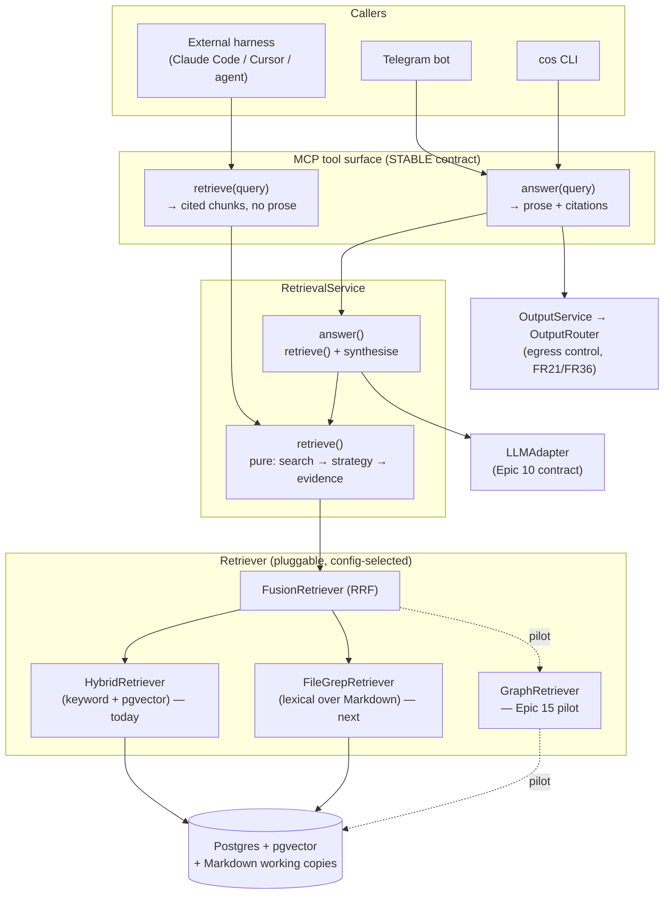
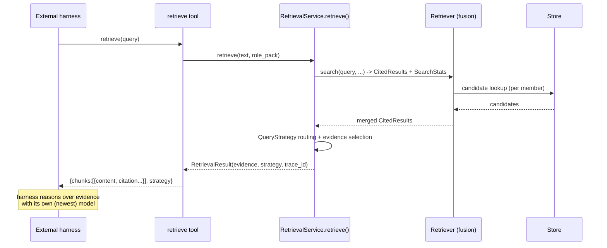
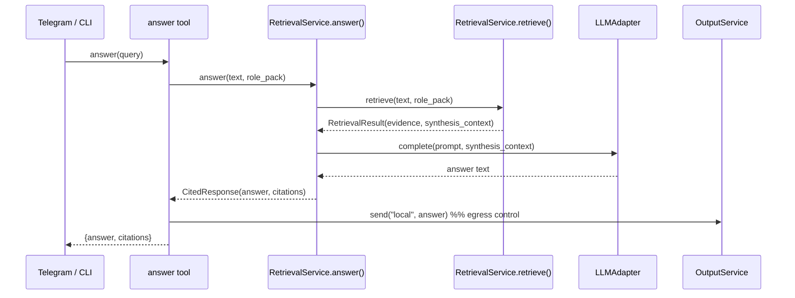
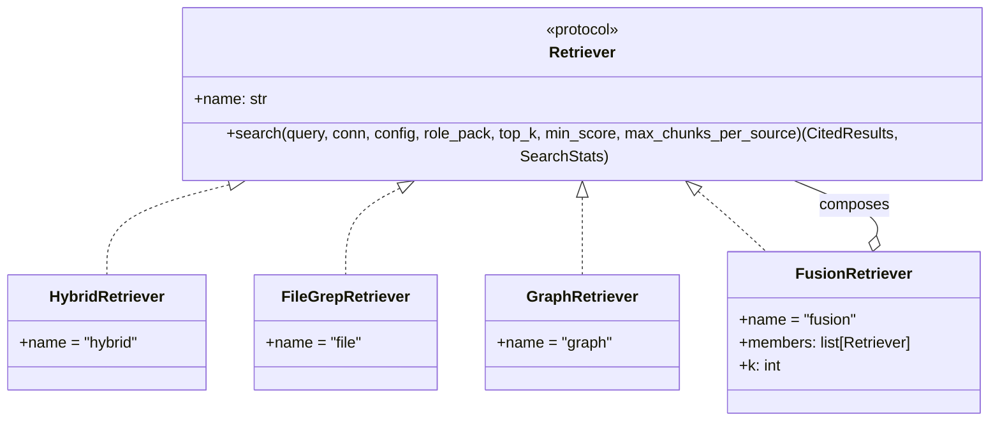
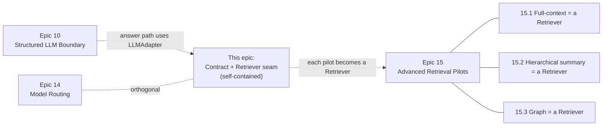

# Retrieval Contract Split & Pluggable Retriever Mechanism

## TL;DR

Two small, orthogonal architectural seams that protect the platform's long-term
relevance as models and harnesses keep changing:

1. **Contract split.** Split the overloaded `retrieve` MCP tool into a pure
   **`retrieve`** (returns cited source chunks, no generated prose) and an
   **`answer`** (retrieve + synthesise, the current behaviour). The pure path
   makes CoS a *portable context layer* that any external harness (Claude Code,
   Cursor, a future agent) can reason over with the newest model, while the
   `answer` path keeps thin clients (CLI, Telegram) working unchanged.

2. **Pluggable retriever.** Introduce a `Retriever` protocol so the retrieval
   *mechanism* — today's pgvector hybrid, plus future lexical/file, graph, and
   fusion strategies — can be swapped behind a **stable MCP contract**,
   selected by config, mirroring the existing `LLMAdapter`/factory pattern.

Together these convert the **Epic 15** retrieval pilots from bespoke spikes into
"implement one `Retriever`, run the existing Epic 7 benchmark."

**Order-independence:** this work stands on its own and delivers value whether or
not Epic 15 ever happens. It does **not** need to be sequenced before anything.
The two seams are independently shippable, and each Epic 15 pilot becomes cheaper
*if* this is already in place but is not blocked by it. Treat sequencing as a
convenience, not a dependency.

## Why now

The harness layer around LLMs is commoditising (see `docs/build-configure-use.md`).
The durable asset a product like CoS owns is its **context layer exposed over
MCP** — the one thing that stays valuable regardless of which harness or model
wins. Two implementation details currently weaken that asset:

- **The `retrieve` tool answers instead of retrieving.** It calls
  `LLMAdapter.complete()` and returns synthesised prose. That couples the
  portable context layer to a specific server-side reasoning step and model
  call. A sophisticated external harness cannot get *just* the grounded
  evidence to reason over with its own (possibly newer/better) model.

- **The retrieval mechanism is hard-wired.** `RetrievalService.query()` calls
  `hybrid_search_with_trace()` directly. The chunk → embed → top-K vector RAG
  mechanism is the most dated part of the stack; the field is moving toward
  lexical/agentic search and hybrid fusion. There is no seam to swap the
  mechanism without touching the service and (worse) without risking the MCP
  tool schema.

Neither is a rewrite. Both are seams that already half-exist in the code:
synthesis is already the *last* step of `query()`, and hybrid search is already
a single call site.

## Decisions

- **`retrieve` becomes the pure path** (returns cited chunks, no prose);
  **`answer` is the synthesis path**. Confirmed 2026-06-10. There are **no real
  external callers yet** — the platform is in active development — so this is a
  clean rename, not a managed breaking change. Resolves former Open Question #1.

## Implementation status

- **Contract split (Stories A+B): IMPLEMENTED** as enabler **EN.2** on 2026-06-10
  — `_bmad-output/implementation-artifacts/enabler-retrieval-contract-split.md`.
  `RetrievalService.retrieve()`/`answer()` (+ deprecated `query()` alias), the
  pure `retrieve` and new `answer` MCP tools, and the Telegram repoint are live.
  Baseline recorded in `architecture.md` → *Enabler Implementation Notes (EN.2)*.
- **Pluggable `Retriever` seam (Stories C+D): NOT yet built.** Deferred,
  order-independent, blocks nothing. This note remains the reference for it.

## Goals

- Expose a **pure retrieval** MCP tool that returns cited chunks and no prose.
- Preserve a **synthesised answer** MCP tool for thin clients (no regression).
- Make the retrieval **mechanism pluggable** behind a stable contract and config.
- Keep the **MCP tool schemas stable** as mechanisms change — this is the moat.
- Keep **citation discipline and egress control** (FR13, FR21, FR36) intact on
  both paths.
- Make **Epic 15 pilots cheap**: each becomes a `Retriever` implementation +
  a benchmark run, not a bespoke integration.

## Non-goals

- Building graph or hierarchical-summary mechanisms here. This note defines the
  **seam**; the mechanisms themselves remain **Epic 15 benchmark-gated pilots**.
- Changing the `LLMAdapter` contract (owned by Epic 10).
- Adding model routing (owned by Epic 14).
- Introducing multi-agent orchestration or a durable workflow engine.

## The two seams, and why they are orthogonal

There are **three** independent axes in retrieval. Keeping them separate is the
whole point — conflating them is how this gets messy.

| Axis | Question it answers | Where it lives | This note |
|------|--------------------|----------------|-----------|
| **Contract** | Does the caller want *evidence* or a *finished answer*? | MCP tool + `RetrievalService` method | **Seam 1 (new)** |
| **Mechanism / Retriever** | *How* do we find candidate chunks? (vector / lexical / graph / fusion) | `Retriever` strategy behind the service | **Seam 2 (new)** |
| **QueryStrategy** | *How* do we assemble context from candidates? (default / bounded / multi-source) | `cos/retrieval/strategy.py` (exists today) | unchanged |

> ⚠️ **Naming guard for implementers:** the existing `QueryStrategy`
> (`DEFAULT` / `BOUNDED` / `MULTI_SOURCE`) is **not** the retrieval mechanism. Do
> not overload the word "strategy". The new mechanism axis is a `Retriever`.
> A request flows: pick a **Retriever** (find candidates) → apply a
> **QueryStrategy** (assemble context) → optionally **synthesise** (answer path).

## Target architecture



The dashed paths are Epic 15 pilots. The solid paths are this foundation. Note
the **answer path still routes egress through `OutputService`/`OutputRouter`**;
the pure retrieve path returns a tool result to the calling harness and does not
itself emit to a channel.

### Sequence: pure `retrieve` (portable path)



### Sequence: `answer` (thin-client path, current behaviour preserved)



### Retriever type model



Every implementation returns the **same `CitedResults`/`SearchStats`** types that
`hybrid_search_with_trace` returns today, so all downstream code
(`narrow_to_lineage`, `select_synthesis_evidence`, context expansion, citation
formatting) is untouched.

## Retrieval mechanisms — when each earns its place

| Mechanism | Strong at | Weak at | Build cost | Status |
|-----------|-----------|---------|-----------|--------|
| **Hybrid (keyword + pgvector)** | conceptual recall, paraphrase | exact tokens, IDs, quotes, freshness; chunking loses structure | built | baseline today |
| **File / lexical** (`ILIKE`/ripgrep over Markdown working copies + `content_blobs`) | exact terms, names, verbatim quotes, recency, *agentic iterative* search | synonyms, concepts | **low** — data already stored | **recommended next** |
| **Graph** (entities + relationships) | multi-hop, **stakeholder-map** questions, timelines | extraction brittleness, maintenance cost | **high** | **Epic 15 pilot only** |
| **Fusion (RRF)** of the above | robust default; members cover each other's blind spots | minor latency; tuning | **low** once members exist | **recommended default** |

Two CoS-specific notes:

- The current `hybrid_search` already blends keyword + semantic — the platform is
  **half-way to fusion**. Generalising into an explicit `FusionRetriever` with
  Reciprocal Rank Fusion is a small step and lands the field's pragmatic default.
- **Graph retrieval has a natural domain trigger**: the role pack's *stakeholder
  map*. Relationship questions ("how is the CHRO connected to the comp review
  across these threads") are exactly where vector/lexical underperform. Build it
  **only** when a stakeholder/relationship workflow needs it — then it slots in
  as a third fusion member with no contract change.

## Config & data model changes

New optional config block (defaults preserve current behaviour):

```yaml
retrieval:
  retriever: hybrid          # hybrid | file | fusion | graph(pilot)
  fusion:
    members: [hybrid, file]  # only read when retriever == fusion
    k: 60                    # RRF constant
  min_score: 0.0             # existing
  max_chunks_per_source: 2   # existing
```

- `RetrievalConfig` (in `cos/config.py`) gains `retriever: str = "hybrid"` and an
  optional `fusion` sub-model. Default `hybrid` ⇒ **zero behaviour change** on
  upgrade.
- New module `cos/retrieval/retriever.py`: the `Retriever` protocol +
  `HybridRetriever` (wraps existing `hybrid_search_with_trace`) + a
  `build_retriever(config)` factory (mirrors `cos/llm/factory.py`).
- New `RetrievalResult` dataclass (in `cos/retrieval/citations.py` or a new
  `results.py`): `evidence`, `synthesis_context`, `strategy`, `trace_id`,
  `outcome`.
- No SQL migration required for the contract split or for hybrid/file retrievers
  (file search reads existing Markdown working copies / `content_blobs`). A graph
  mechanism *would* need migrations, but that is deferred to the Epic 15 pilot
  and out of scope here.

## Backward compatibility & migration

- `retrieve` tool changes shape (prose → chunks). With **no real external callers
  yet**, this is a clean rename rather than a managed break. The only internal
  callers to repoint are the thin clients — `connectors/telegram_bot.py` and the
  CLI — which switch from the old answering `retrieve` to the new `answer` tool
  (one line each).
- `RetrievalService.query()` may be renamed to `answer()` outright rather than
  kept as an alias, since nothing external depends on it. Keep an alias only if it
  reduces churn in existing tests; otherwise drop it.
- Telemetry: the single combined emit becomes two (retrieval in `retrieve()`,
  synthesis in `answer()`), which finally lets retrieval latency be measured
  independent of model latency. Existing log field names are preserved;
  `synthesis_latency_ms` is simply `null` on the pure path.

## Observability & benchmark gates

- Reuse the **Epic 7** benchmark harness. Each retriever is judged on the
  existing query classes for factuality, citation discipline, latency, and cost
  — never "by intuition" (consistent with Epic 15's stated gate).
- `SearchStats` gains a `retriever` label (and per-member counts under fusion) so
  reports attribute candidates to the mechanism that produced them.
- A new retriever may only become the **default** if it wins on the benchmark for
  the relevant query classes; otherwise it stays config-opt-in/experimental.

## Security & governance

- Egress control is **unchanged**: only `answer` emits to a channel, via
  `OutputService`/`OutputRouter` (FR21, FR36). The pure `retrieve` returns a tool
  result to the caller and never opens a new output path.
- Citations remain mandatory on both paths (FR13). Pure `retrieve` returns
  citations *with* chunk content so the caller can re-ground and re-cite.
- No new external network egress is introduced by hybrid/file retrievers.

## Risks & mitigations

| Risk | Mitigation |
|------|-----------|
| Breaking external `retrieve` callers | Ship `answer` first; migrate known callers in the same epic; keep `query()` alias one release |
| "Strategy" naming collision with `QueryStrategy` | Use `Retriever` for the mechanism axis; document the three-axis model (above) in code + epic |
| Fusion adds latency | RRF is cheap; benchmark-gate; fusion is opt-in, `hybrid` stays default until proven |
| Scope creep into graph/orchestration | Hard non-goal here; graph stays an Epic 15 pilot consuming this seam |
| Pure-retrieve evidence misused without citations | Tool returns citations inline; document the contract; egress unaffected |

## Proposed epic & story breakdown (for BMAD)

> **Sequencing note:** this epic is **order-independent** — implement it whenever
> convenient. It has **no hard dependency** on other epics: it touches only the
> retrieval/MCP layer that already exists today. It *relates* to Epic 10 (the
> `answer` path will use whatever the `LLMAdapter` becomes) and to Epic 15 (each
> pilot becomes a `Retriever`), but neither is a blocker in either direction. If
> done before Epic 15 it de-duplicates the 15.x pilots; if done after, the seam is
> retrofitted and the pilots fold into it. Final numbering/placement is the
> planner's call — design the stories to be self-contained.
>
> **Intra-epic independence:** the two seams are themselves separable. Stories A+B
> (contract split) and Stories C+D (pluggable retriever) can ship in either order
> or as two smaller epics. They share no code dependency beyond both living in the
> retrieval layer.

**Proposed Epic: Retrieval Contract & Pluggable Retriever Foundation**

Goal: split the retrieval contract into pure-retrieval vs. synthesis, and
introduce a config-selected `Retriever` seam, without changing default behaviour
or retrieval quality — establishing the stable MCP contract that future
mechanisms plug into.

**FRs touched:** FR11, FR12, FR13, FR14, FR21, FR36 (no new FR closed; this is a
vision-track architecture enabler that strengthens existing FRs).
**NFRs:** portability, observability, latency measurement (align to the NFR ids
Epic 15 already cites: NFR1, NFR12, NFR19).

The story set follows the house pattern (Operator Validation second-to-last,
Documentation & Housekeeping last).

### Story A — Pure `retrieve()` service method + `RetrievalResult`

As a maintainer, I want `RetrievalService` to expose a pure `retrieve()` that
stops at evidence selection, so retrieval is usable without forcing synthesis.

- **Given** a query that currently returns a synthesised answer, **When**
  `retrieve()` is called, **Then** it returns evidence chunks, the selected
  `QueryStrategy`, and a trace id — and performs **no** LLM call.
- **Given** the refactor, **When** `answer()` is called, **Then** it delegates to
  `retrieve()` then synthesises, and produces byte-for-byte equivalent answers to
  the pre-refactor `query()` on the benchmark set.
- **Given** retrieval telemetry, **When** a pure `retrieve()` runs, **Then** a
  retrieval-only log is emitted with `synthesis_latency_ms = null`.

### Story B — Split MCP tools: `retrieve` (pure) + `answer` (synthesis)

As an external harness, I want a `retrieve` tool that returns cited chunks and an
`answer` tool that returns prose, so I can choose to reason myself.

- **Given** the MCP surface, **When** `retrieve(query)` is called, **Then** it
  returns `{chunks:[{content, source_alias, source_locator, document_version_id,
  chunk_index, score}], strategy, outcome}` and emits to **no** channel.
- **Given** the MCP surface, **When** `answer(query)` is called, **Then** it
  returns `{answer, citations}` and routes egress via `OutputService` exactly as
  the current `retrieve` tool does.
- **Given** the only internal callers (Telegram bot, CLI), **When** they are
  migrated, **Then** they call `answer` and their behaviour is unchanged.
- **Given** no real external callers exist yet, **When** `query()` is renamed to
  `answer()`, **Then** an alias is optional — kept only if it reduces test churn.

### Story C — `Retriever` protocol, `HybridRetriever`, and factory

As a maintainer, I want retrieval mechanism behind a `Retriever` protocol
selected by config, so the mechanism can change without touching the service or
MCP contract.

- **Given** `retrieval.retriever: hybrid` (default), **When** `retrieve()` runs,
  **Then** it routes through `HybridRetriever`, which wraps the existing hybrid
  search and yields identical results to today on the benchmark.
- **Given** an unknown `retriever` value, **When** config loads, **Then** startup
  fails fast with a clear error naming valid options.
- **Given** `SearchStats`, **When** any retriever runs, **Then** stats carry a
  `retriever` label for attribution in benchmark reports.

### Story D — `FileGrepRetriever` + `FusionRetriever` (RRF)

As a maintainer, I want a lexical file retriever and an RRF fusion retriever, so
exact-match and conceptual recall reinforce each other and the platform gains an
agentic-search escape hatch.

- **Given** `retrieval.retriever: file`, **When** a query with exact names/IDs is
  run, **Then** lexical matches over Markdown working copies are returned as
  `CitedResults` with correct provenance.
- **Given** `retrieval.retriever: fusion` with `members: [hybrid, file]`, **When**
  a query runs, **Then** member result lists are merged via Reciprocal Rank
  Fusion using the configured `k`.
- **Given** the Epic 7 benchmark, **When** fusion is compared to hybrid baseline,
  **Then** results are reported per query class; fusion only becomes default if
  it wins, otherwise it stays opt-in.

### Story E — Operator Validation: contract split & retriever swap live

As Iain (operator), I want to confirm the split tools and retriever config work
end to end on a real instance.

- **Given** a running instance, **When** an external MCP client calls `retrieve`,
  **Then** it receives cited chunks with content and no prose.
- **Given** the same instance, **When** Telegram/CLI ask a question, **Then** they
  receive a synthesised cited answer (no regression).
- **Given** `retrieval.retriever` is changed in config and the instance
  restarted, **When** a query runs, **Then** logs show the selected retriever and
  retrieval still returns grounded, cited results.

### Story F — Documentation & Housekeeping

As Iain (operator and maintainer), I want the contract split and retriever seam
documented so experimental mechanisms stay distinguishable from the baseline.

- **Given** the epic is complete, **When** docs are reviewed, **Then** they
  describe the three-axis model (contract / retriever / query-strategy), the two
  MCP tools, the config surface, and which retrievers are default vs.
  experimental.
- **Given** `architecture.md`, **When** updated, **Then** it records the
  `Retriever` boundary alongside the existing LLM and Output boundaries, and the
  Epic 15 pilots reference this foundation.

## Relationship to existing epics (all soft, no blockers)

These are **affinities, not dependencies**. Every edge below is dashed on
purpose — this epic can ship before or after any of them.



- **Epic 10 (Structured LLM Boundary):** soft affinity. The `answer` path uses
  whatever the `LLMAdapter` becomes; this note does not change that contract and
  works against the current one.
- **Epic 14 (Model Routing):** orthogonal — routing is about *which model*, this
  is about *evidence vs. answer* and *which retriever*.
- **Epic 15 (Advanced Retrieval Modes):** natural beneficiary, not a dependant.
  If this seam exists first, Stories 15.1/15.2/15.3 can be expressed as
  `Retriever` implementations judged on the Epic 7 benchmark. If Epic 15 runs
  first, its pilots can be retrofitted onto the seam later. Either order works.

## Open questions (for elicitation)

1. Should the pure `retrieve` tool accept an optional `mode` argument
   (`hybrid|file|fusion`) so a sophisticated harness can pick a mechanism per
   call, or stay strictly config-driven? Recommendation: config default + optional
   override.
2. Does `FileGrepRetriever` belong in this foundation epic (Story D) or as the
   first Epic 15 pilot? Recommendation: keep it here — it is cheap, needs no new
   data, and proves the seam with a second real mechanism.

_(Former Q1 — tool naming — is resolved; see Decisions.)_
