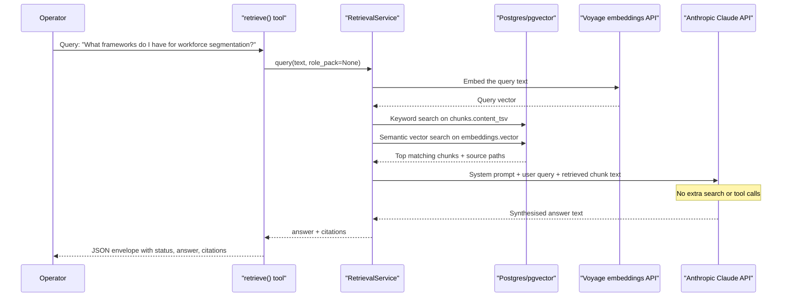

# Manual Testing Guide

Reflects the platform as built at the end of **Epic 4: Role Identity & Configuration**. Run these tests to verify the platform is healthy, documents are ingested, questions are answered with grounded citations, and the CHRO role identity is active and switchable.

This guide is rewritten at the end of each epic to reflect current platform state — it does not accumulate historical tests.

---

## Prerequisites

- Docker Desktop (or Rancher Desktop) running
- `uv` installed
- Working directory: `cos/`
- A valid `config.yaml` present (copy from `config.yaml.example` and fill in `llm.api_key` and `embedding.api_key` — both are required; `embedding.api_key` is needed for document ingestion to generate embeddings)

**Always use `uv run python`** (not `python3`) for any command that imports project code.

---

## What Epic 4 delivers

- Full document ingestion pipeline: PDF, Word (`.docx`), Markdown, and plain text (from Epic 2)
- `cos ingest <path>` — ingest a single file or folder from the CLI
- `cos docs` — list all ingested documents with provenance metadata
- `cos docs --versions <id>` — show version history for a document
- `cos docs --json` — machine-readable JSON output
- All four MCP tools working end-to-end:
  - `get_status` — platform health and component status
  - `retrieve` — hybrid search + LLM synthesis with CHRO tone and retrieval priorities applied
  - `list_documents` — returns all ingested documents with `id`, `source_path`, `ingested_at`, `current_version`, `chunk_count`
  - `get_role_context` — returns full CHRO configuration: role name, goals, tone, knowledge taxonomy, active workflows
- Role pack system: define role identity in `role_packs/chro.yaml`; switch by editing `config.yaml` and restarting — no code change required
- Two role packs included: `role_packs/chro.yaml` (CHRO) and `role_packs/enterprise_architect.yaml`
- OutputRouter enforces fail-closed egress: unrecognised channels suppress output and log a structured error

Other CLI commands such as `cos status`, `cos logs`, and `cos restart` remain stubs.

---

## 1 — Start the platform

```bash
docker compose up -d
```

Wait 30–60 seconds, then:

```bash
docker compose ps
```

**Expected:** All three services showing `(healthy)`.

```
NAME               STATUS
cos-cos-1          Up X seconds (healthy)
cos-postgres-1     Up X seconds (healthy)
cos-tika-1         Up X seconds (healthy)
```

**Fail signal:** Any service showing `unhealthy`, `starting`, or `Exit`.

---

## 2 — Verify startup logs

```bash
docker compose logs cos --tail=20
```

**Expected:** All lines are JSON objects. The sequence ends with these messages in order:

- `"message": "Postgres: healthy"`
- `"message": "Tika: healthy"`
- `"message": "config loaded"`
- `"message": "migrations applied"`
- `"message": "Role pack loaded"` — component is `"rolepack"`, includes `"role_name": "CHRO"`
- `"message": "connection pool: open"`
- `"message": "output router: initialised"`
- `"message": "retrieval service: initialised"`
- `"message": "MCP server: listening"`

**Note:** `"connection pool: open"` now appears after `"Role pack loaded"` — this is intentional (pool creation follows role pack validation).

**Fail signal:** Any plain-text log line, missing entries, `"role pack: stub loaded"` (obsolete stub message), or traceback.

---

## 3 — Verify database schema

```bash
docker compose exec postgres psql -U postgres -d cos -c "\dt"
```

**Expected:** Four tables: `chunks`, `document_versions`, `documents`, `embeddings`.

```bash
docker compose exec postgres psql -U postgres -d cos -c "\d documents"
```

**Expected:** Columns include `id` (uuid), `source_path` (text), `file_hash` (text), `ingested_at` (timestamptz), `current_version` (integer), `status` (text).

**Fail signal:** Missing table or column, or `psql` error.

---

## 4 — Verify config loads correctly

```bash
uv run python -c "
from cos.config import CosConfig
config = CosConfig.load('config.yaml')
print('provider:', config.llm.provider)
print('model:', config.llm.model)
print('role_pack:', config.role_pack.path)
print('channels:', config.channels)
print('database host:', config.database.host)
print('tika url:', config.tika.url)
print('config loaded ok')
"
```

**Expected:** Field values printed from your `config.yaml`, ending with `config loaded ok`.

**Fail signal:** Any exception or unexpected `None` values.

---

## 5 — Verify config validation rejects bad input

```bash
uv run python -c "
import tempfile, pathlib
from cos.config import CosConfig
bad = pathlib.Path(tempfile.mktemp(suffix='.yaml'))
bad.write_text('embedding:\n  provider: anthropic\n  model: voyage-3\n')
try:
    CosConfig.load(bad)
except SystemExit as e:
    print('SystemExit caught — message:')
    print(str(e))
"
```

**Expected:** `SystemExit` with a human-readable message identifying `llm` as the missing field. No raw traceback.

**Fail signal:** Raw `ValidationError` traceback, or no mention of the missing field.

---

## 6 — Verify `get_status` (no MCP client needed)

```bash
docker compose exec -i cos uv run python -c "
import asyncio, json, cos.mcp_server.server as srv
from cos.config import CosConfig
from cos.mcp_server.tools import get_status
srv._config = CosConfig.load('/app/config.yaml')
result = json.loads(asyncio.run(get_status()))
assert result['status'] == 'ok', result
assert result['data']['ready'] == True, result
print('get_status ok')
print(json.dumps(result['data']['components'], indent=2))
"
```

**Expected:** `get_status ok` followed by three components all showing `"healthy": true`.

**Fail signal:** `status` not `"ok"`, `ready` not `true`, or any exception.

---

## 7 — Verify tools return valid envelopes

```bash
docker compose exec -i cos uv run python -c "
import asyncio, json
import cos.mcp_server.server as srv
from cos.config import CosConfig
from cos.mcp_server.tools import get_role_context, get_status

async def main():
    config = CosConfig.load('/app/config.yaml')
    await srv._startup_sequence(config)

    # get_status
    result = json.loads(await get_status())
    assert result['status'] == 'ok', f'get_status failed: {result}'
    print('get_status — ok')

    # get_role_context
    result = json.loads(await get_role_context())
    assert result['status'] == 'ok', f'get_role_context failed: {result}'
    assert 'role_name' in result['data'], f'Missing role_name field: {result}'
    print('get_role_context — ok, role:', result['data']['role_name'])

asyncio.run(main())
"
```

**Expected:** Both tools print `ok`. `get_role_context` reports `CHRO` (not the old stub `"default — role pack not yet configured"`).

**Fail signal:** `status != "ok"` for either tool, or any exception.

---

## 8 — Connect Claude Code and call tools live

**Prerequisite:** Documents must be ingested before testing `retrieve`. Run T2.6.1 (ingest `test-docs/`) if you have not already done so — the live `retrieve` query in this section requires at least one document in the knowledge base.

If not already configured, run from the `cos/` directory:

```bash
claude mcp add cos -- docker compose exec -i cos uv run cos-mcp
```

Open a new Claude Code session and ask:

```
What MCP tools do you have available?
```

**Expected:** Four tools listed — `get_status`, `retrieve`, `get_role_context`, `list_documents`.

Then ask:

```
Call get_status and show me the raw JSON response.
```

**Expected:** `status: "ok"`, three healthy components, `ready: true`.

Then ask:

```
Use retrieve to answer: What frameworks do I have for workforce segmentation?
```

**Expected:** `status: "ok"`, `data.answer` is a grounded summary, and `citations` contains at least one source from the ingested knowledge base.

Then ask:

```
Call list_documents and show me the raw JSON response.
```

**Expected:** `status: "ok"`, `data.documents` is a list (may be empty if no documents ingested yet; see Epic 3 tests for ingestion).

Then ask:

```
Call get_role_context.
```

**Expected:** `status: "ok"`, `data.role_name` is `"CHRO"`, `data.goals` is a list, `data.tone` describes the CHRO persona — not the old stub text.

---

## 9 — Verify all log lines are valid JSON

```bash
docker compose logs cos 2>&1 | uv run python -c "
import sys, json
bad = []
for i, line in enumerate(sys.stdin, 1):
    line = line.strip()
    if not line:
        continue
    try:
        json.loads(line)
    except json.JSONDecodeError:
        bad.append(f'  line {i}: {line[:120]}')
if bad:
    print(f'FAIL: {len(bad)} non-JSON lines:')
    print('\n'.join(bad))
    sys.exit(1)
else:
    print('ok: all log lines are valid JSON')
"
```

**Expected:** `ok: all log lines are valid JSON`.

---

## 10 — Restart round-trip

```bash
docker compose down
docker compose up -d
```

Wait 30–60 seconds, then:

```bash
docker compose ps
```

**Expected:** All three services back to `(healthy)` with no manual intervention.

Follow up with test 2 (startup logs) to confirm clean restart.

---

## Epic 2: Document Ingestion & Provenance

**Prerequisites:**

- Platform running: `docker compose up -d` with all three services healthy
- `test-docs/` directory exists with `sample-brief.md`, `sample-report.pdf`, `sample-memo.docx`
- Working directory: `cos/`

### T2.6.1 — Ingest `test-docs/` folder: all 3 files ingested [LIVE]

```bash
docker compose run --rm --entrypoint /app/.venv/bin/cos -v "$(pwd)/test-docs:/test-docs" cos ingest /test-docs/
```

**Expected output (order may vary):**

```text
Ingested sample-brief.md -> N chunks indexed
Ingested sample-report.pdf -> N chunks indexed
Ingested sample-memo.docx -> N chunks indexed
Ingested 3 files -> N total chunks indexed
```

All three file names appear. Chunk counts are at least 1. No error lines appear.

**Fail signal:** Any `Error:` line, a file listed as skipped unexpectedly, or a chunk count of `0` for any file.

### T2.6.2 — `cos docs` shows 3 documents with correct metadata [LIVE]

```bash
docker compose run --rm --entrypoint /app/.venv/bin/cos cos docs
```

**Expected:** A table with 3 rows, one per test document.

Each row must have:

- `ID` — a UUID for the document (copy this value when using `--versions`)
- `SOURCE PATH` ending in `/test-docs/sample-brief.md`, `/test-docs/sample-report.pdf`, or `/test-docs/sample-memo.docx`
- `INGESTED AT` showing a recent timestamp
- `VER` = `1` for each document on first ingest
- `CHUNKS` >= `1` for each document

**Fail signal:** Fewer than 3 rows, `CHUNKS = 0`, `VER` not equal to `1`, or source paths that do not match the test files.

### T2.6.3 — Re-ingest and version history [LIVE]

First capture the document ID for `sample-brief.md`:

```bash
docker compose run --rm --entrypoint /app/.venv/bin/cos cos docs
```

Copy the UUID from the `ID` column in the row for `sample-brief.md`.

Re-ingest the same file:

```bash
docker compose run --rm --entrypoint /app/.venv/bin/cos -v "$(pwd)/test-docs:/test-docs" cos ingest /test-docs/sample-brief.md
```

Check version history:

```bash
docker compose run --rm --entrypoint /app/.venv/bin/cos cos docs --versions "<document-id>"
```

**Expected:** Two rows are shown with version numbers `1` and `2`. The timestamps should be distinct and the file hashes may either match or differ depending on whether the file changed.

**Fail signal:** Only one version row appears, or the CLI prints `No versions found for document ID`.

### T2.6.4 — Originals are preserved byte-for-byte [LIVE]

```bash
ls -la data/originals/
diff test-docs/sample-brief.md data/originals/sample-brief.md && echo "sample-brief.md: identical"
diff test-docs/sample-report.pdf data/originals/sample-report.pdf && echo "sample-report.pdf: identical"
diff test-docs/sample-memo.docx data/originals/sample-memo.docx && echo "sample-memo.docx: identical"
```

**Expected:** All three comparison commands print `<name>: identical` and the three files are present in `data/originals/`.

**Fail signal:** Any `diff` output, any missing file, or a size mismatch between a source file and its stored original.

### T2.6.5 — Crash recovery leaves no partial document rows [LIVE]

Use `exec` rather than `run` for this test so the ingest process runs inside the existing `cos` container and can be killed predictably. First copy the fixtures into the running container:

```bash
docker compose cp test-docs/. cos:/tmp/test-docs
docker compose exec cos uv run cos ingest /tmp/test-docs
```

While ingestion is running, in a second terminal:

```bash
docker compose kill cos
docker compose up -d cos
sleep 10
docker compose run --rm --entrypoint /app/.venv/bin/cos cos docs
```

**Expected:** After restart, `cos docs` shows only fully indexed documents. No row should appear with a missing chunk count or partially written state. A document is either present with a valid chunk count or absent.

**Fail signal:** Any partial record appears after restart, such as a document row with `CHUNKS = 0` caused by the interrupted ingest.

### T2.6.6 — `cos docs --json` returns valid JSON with all fields [LIVE]

```bash
docker compose run --rm --entrypoint /app/.venv/bin/cos cos docs --json
```

**Expected:** A JSON array. Each item includes:

- `id`
- `source_path`
- `ingested_at`
- `current_version`
- `chunk_count`

**Fail signal:** Invalid JSON, missing fields, or an empty array after successful ingestion.

---

## Epic 3: Knowledge Retrieval & Cited Q&A

**Prerequisites:**

- Platform running: `docker compose up -d` (all three services healthy)
- `test-docs/` directory exists with `sample-brief.md`, `sample-report.pdf`, `sample-memo.docx`
- Documents ingested (run T2.6.1 if not already done)
- `config.yaml` has a valid `llm.api_key` — synthesis requires a live Claude API call
- Working directory: `cos/`

---

### T3.5.1 — `retrieve` returns a synthesised answer with citations [LIVE]

```bash
docker compose exec -i cos uv run python -c "
import asyncio, json
import cos.mcp_server.server as srv
from cos.config import CosConfig
from cos.mcp_server.tools import retrieve

async def main():
    config = CosConfig.load('/app/config.yaml')
    await srv._startup_sequence(config)
    result = json.loads(await retrieve(query='What frameworks do I have for workforce segmentation?'))
    print(json.dumps(result, indent=2))

asyncio.run(main())
"
```

**Expected:**

```json
{
  "status": "ok",
  "data": {
    "answer": "<synthesised answer referencing ingested content>",
    "citations": [
      {
        "source_path": "/test-docs/sample-brief.md",
        "chunk_index": 0,
        "score": 0.91
      }
    ]
  },
  "citations": [
    {
      "source_path": "/test-docs/sample-brief.md",
      "chunk_index": 0,
      "score": 0.91
    }
  ]
}
```

Note: `citations` appears at both the top level and inside `data` — this is the standard tool envelope. Both fields contain identical data; the top-level `citations` field is consistent across all four tools.

- `status` is `"ok"`
- `data.answer` is a non-empty string
- `data.citations` contains at least one item
- Each citation has `source_path`, `chunk_index` (integer), and `score` (float)
- `source_path` is a path to one of the ingested test documents

**Fail signal:** `status != "ok"`, empty `data.citations`, or `data.answer` is null.

#### Retrieval Sequence

The live `retrieve` path in T3.5.1 performs one query embedding call to Voyage, then one synthesis call to Anthropic. Claude does not perform any additional search or tool use during answer generation; it only receives the retrieved chunk text plus the user query.



**What Claude actually sees**

- The original user question
- A fixed system prompt instructing grounded answering
- The retrieved chunk contents as numbered context blocks

Claude does not see the full original documents unless those document contents are present in the retrieved chunks, and it does not independently query the database, Voyage, Tika, or the web during this Epic 3 flow.

---

### T3.5.2 — Citations correspond to actual ingested documents [LIVE]

Run the `retrieve` tool (T3.5.1 above) and collect the `source_path` values from citations.

Then verify each appears in `cos docs` output:

```bash
docker compose run --rm --entrypoint /app/.venv/bin/cos cos docs
```

**Expected:** Every `source_path` returned in the `retrieve` response appears as a `SOURCE PATH` row in `cos docs` output. No citation points to a file that is not in the knowledge base.

To verify `chunk_index` validity: note the `CHUNKS` count for each cited document in `cos docs` output. Every `chunk_index` must be >= 0 and strictly less than that document's `CHUNKS` count.

**Fail signal:** A citation `source_path` not listed in `cos docs`, or a `chunk_index` that is negative or >= the `CHUNKS` count for that document.

---

### T3.5.3 — No-content query returns graceful no-results answer [LIVE]

```bash
docker compose exec -i cos uv run python -c "
import asyncio, json
import cos.mcp_server.server as srv
from cos.config import CosConfig
from cos.mcp_server.tools import retrieve

async def main():
    config = CosConfig.load('/app/config.yaml')
    await srv._startup_sequence(config)
    result = json.loads(await retrieve(query='quantum entanglement theory and photon spin states'))
    print(json.dumps(result, indent=2))

asyncio.run(main())
"
```

**Expected:**

- `status` is `"ok"`
- `data.answer` clearly states no relevant content was found — wording similar to `"No relevant content found in the knowledge base."`
- `data.citations` is an empty list `[]`
- No invented source paths or fabricated chunk references

**Fail signal:** `status == "error"`, fabricated citations, or an answer that invents content not present in any ingested document.

---

### T3.5.4 — `list_documents` MCP tool matches `cos docs` CLI [LIVE]

Run both and compare:

```bash
# MCP tool output
docker compose exec -i cos uv run python -c "
import asyncio, json
import cos.mcp_server.server as srv
from cos.config import CosConfig
from cos.mcp_server.tools import list_documents

async def main():
    config = CosConfig.load('/app/config.yaml')
    await srv._startup_sequence(config)
    result = json.loads(await list_documents())
    print(json.dumps(result, indent=2))

asyncio.run(main())
"

# CLI output (for comparison)
docker compose run --rm --entrypoint /app/.venv/bin/cos cos docs --json
```

**Expected:**

- `list_documents` returns `status: "ok"`, `data.documents` is a list
- Each item in `data.documents` has: `id`, `source_path`, `ingested_at`, `current_version`, `chunk_count`
- The set of `source_path` values matches between `list_documents` and `cos docs --json`
- Document count is the same in both outputs

**Fail signal:** Mismatched document counts, missing fields in MCP response, or `status != "ok"`.

---

### T3.5.5 — OutputRouter fail-closed: unrecognised channel suppresses output [LIVE]

```bash
docker compose exec -i cos uv run python -c "
import logging
from cos.output.router import OutputRouter
logging.basicConfig(level=logging.ERROR, format='%(message)s')
router = OutputRouter(configured_channels=['local'])
router.send('nonexistent_channel', 'this content must be suppressed')
print('no exception raised — output suppressed')
"
```

**Expected:** Two things appear in the same command output:

- A JSON error log line with `"component": "output"` and `"channel": "nonexistent_channel"`
- `no exception raised — output suppressed`

The test content itself must not be delivered anywhere. This check runs in a short-lived `docker compose exec` Python process, so the error log is emitted by that exec session rather than the long-running `cos` service process. For that reason, `docker compose logs cos` is not the reliable place to verify this specific error.

**Fail signal:** An exception is raised, no structured `"component": "output"` error appears in the exec command output, or the channel test content is delivered anywhere.

---

## Epic 4: Role Identity & Configuration

**Prerequisites:**

- Platform running: `docker compose up -d` (all three services healthy)
- `config.yaml` has `role_pack.path: role_packs/chro.yaml` (the default)
- Documents ingested (run T2.6.1 if not already done — the retrieve test requires at least one document)
- `config.yaml` has valid `llm.api_key` and `embedding.api_key`
- Working directory: `cos/`

---

### T4.5.1 — `get_role_context` returns CHRO configuration [LIVE]

```bash
docker compose exec -i cos uv run python -c "
import asyncio, json
import cos.mcp_server.server as srv
from cos.config import CosConfig
from cos.mcp_server.tools import get_role_context

async def main():
    config = CosConfig.load('/app/config.yaml')
    await srv._startup_sequence(config)
    result = json.loads(await get_role_context())
    print(json.dumps(result, indent=2))
    assert result['status'] == 'ok', f'unexpected status: {result}'
    assert result['data']['role_name'] == 'CHRO', f'unexpected role_name: {result}'
    assert isinstance(result['data']['goals'], list) and len(result['data']['goals']) > 0
    assert 'Strategic' in result['data']['tone'], f'unexpected tone: {result}'
    assert isinstance(result['data']['knowledge_taxonomy'], list)
    assert isinstance(result['data']['active_workflows'], list)
    assert result['citations'] == [], f'expected empty citations: {result}'
    print('get_role_context ok — CHRO role pack active')

asyncio.run(main())
"
```

**Expected:**

```json
{
  "status": "ok",
  "data": {
    "role_name": "CHRO",
    "goals": ["Drive HR transformation focused on PE value creation levers...", "..."],
    "tone": "Strategic and evidence-based — translate HR concepts into business and financial impact...",
    "knowledge_taxonomy": ["HR operating models and transformation frameworks", "..."],
    "active_workflows": ["hr_diagnostic", "ceo_board_prep", "weekly_prioritisation", "communication_drafting"]
  },
  "citations": []
}
```

- `status` is `"ok"`
- `data.role_name` is exactly `"CHRO"`
- `data.goals` is a non-empty list
- `data.tone` contains `"Strategic"` — confirms CHRO persona loaded from YAML
- `data.knowledge_taxonomy` is a non-empty list
- `data.active_workflows` is a non-empty list
- `citations` is an empty list

**Fail signal:** `status != "ok"`, `data.role_name` is missing or not `"CHRO"`, `data` contains `"role": "default..."` (old stub), or any exception.

---

### T4.5.2 — `retrieve` applies CHRO tone to synthesised answers [LIVE]

```bash
docker compose exec -i cos uv run python -c "
import asyncio, json
import cos.mcp_server.server as srv
from cos.config import CosConfig
from cos.mcp_server.tools import retrieve

async def main():
    config = CosConfig.load('/app/config.yaml')
    await srv._startup_sequence(config)
    result = json.loads(await retrieve(query='What frameworks do I have for workforce segmentation?'))
    print(json.dumps(result, indent=2))

asyncio.run(main())
"
```

**Expected:**

- `status` is `"ok"`
- `data.answer` is a non-empty string with a commercially-minded, evidence-based tone (not generic or HR-jargon-heavy)
- `data.citations` contains at least one item (requires ingested test docs)

Observe the answer language: with the CHRO role pack active, the synthesis prompt includes the instruction to be *"direct, concise, and commercially-minded"* and to *"translate HR concepts into business and financial impact"*. The answer should reflect this framing compared to a plain retrieval without role context.

**Fail signal:** `status != "ok"`, empty `data.citations`, `data.answer` is null.

---

### T4.5.3 — Switch to Enterprise Architect role pack [LIVE]

**Step 1:** Edit `config.yaml` on the host (in the `cos/` directory):

```yaml
role_pack:
  path: role_packs/enterprise_architect.yaml   # was: role_packs/chro.yaml
```

**Step 2:** Restart the `cos` container:

```bash
docker compose restart cos
```

Wait ~30 seconds, then check startup logs:

```bash
docker compose logs cos --tail=20
```

**Expected log entry:** A JSON line with `"message": "Role pack loaded"` and `"role_name": "Enterprise Architect"`.

**Step 3:** Verify `get_role_context` returns Enterprise Architect data:

```bash
docker compose exec -i cos uv run python -c "
import asyncio, json
import cos.mcp_server.server as srv
from cos.config import CosConfig
from cos.mcp_server.tools import get_role_context

async def main():
    config = CosConfig.load('/app/config.yaml')
    await srv._startup_sequence(config)
    result = json.loads(await get_role_context())
    print(json.dumps(result, indent=2))
    assert result['status'] == 'ok', f'unexpected status: {result}'
    assert result['data']['role_name'] == 'Enterprise Architect', f'unexpected role_name: {result}'
    assert 'pragmatic' in result['data']['tone'].lower(), f'unexpected tone: {result}'
    print('get_role_context ok — Enterprise Architect role pack active')

asyncio.run(main())
"
```

**Expected:** `data.role_name` is `"Enterprise Architect"`, `data.tone` reflects architecture/pragmatic framing (different from CHRO strategic/evidence-based).

**Step 4:** Run the same workforce query and observe the different response style:

```bash
docker compose exec -i cos uv run python -c "
import asyncio, json
import cos.mcp_server.server as srv
from cos.config import CosConfig
from cos.mcp_server.tools import retrieve

async def main():
    config = CosConfig.load('/app/config.yaml')
    await srv._startup_sequence(config)
    result = json.loads(await retrieve(query='What frameworks do I have for workforce segmentation?'))
    print(result['data']['answer'])

asyncio.run(main())
"
```

**Expected:** Answer reflects the Enterprise Architect tone: structured, pragmatic, with technical/business alignment framing — noticeably different from the CHRO answer in T4.5.2.

**Fail signal:** `data.role_name` is `"CHRO"` (container not restarted), `status != "ok"`, or any exception.

---

### T4.5.4 — Revert to CHRO confirms full reversibility [LIVE]

**Step 1:** Edit `config.yaml` back on the host:

```yaml
role_pack:
  path: role_packs/chro.yaml   # restore CHRO
```

**Step 2:** Restart the `cos` container:

```bash
docker compose restart cos
```

Wait ~30 seconds, then verify:

```bash
docker compose exec -i cos uv run python -c "
import asyncio, json
import cos.mcp_server.server as srv
from cos.config import CosConfig
from cos.mcp_server.tools import get_role_context

async def main():
    config = CosConfig.load('/app/config.yaml')
    await srv._startup_sequence(config)
    result = json.loads(await get_role_context())
    assert result['status'] == 'ok', f'unexpected status: {result}'
    assert result['data']['role_name'] == 'CHRO', f'unexpected role_name: {result}'
    print('get_role_context ok — CHRO restored')

asyncio.run(main())
"
```

**Expected:** `data.role_name` is `"CHRO"` again. The switch is fully reversible with no code changes.

**Fail signal:** `data.role_name` is still `"Enterprise Architect"`, or any exception.

---

## 11 — Running all live tests

Use this sequence for a concise end-to-end operator pass:

```bash
# 1. Start services
docker compose up -d
docker compose ps

# 2. Ingest test fixtures
docker compose run --rm --entrypoint /app/.venv/bin/cos -v "$(pwd)/test-docs:/test-docs" cos ingest /test-docs/

# 3. Check provenance table output
docker compose run --rm --entrypoint /app/.venv/bin/cos cos docs

# 4. Validate JSON docs output
docker compose run --rm --entrypoint /app/.venv/bin/cos cos docs --json | uv run python -c "
import sys, json
docs = json.load(sys.stdin)
assert len(docs) >= 3 and all(d['chunk_count'] > 0 for d in docs)
print(f'cos docs ok: {len(docs)} documents, all indexed')
"

# 5. Retrieve with citations (requires live LLM API — may take up to 5 seconds)
docker compose exec -i cos uv run python -c "
import asyncio, json
import cos.mcp_server.server as srv
from cos.config import CosConfig
from cos.mcp_server.tools import retrieve

async def main():
    config = CosConfig.load('/app/config.yaml')
    await srv._startup_sequence(config)
    result = json.loads(await retrieve(query='What frameworks do I have for workforce segmentation?'))
    assert result['status'] == 'ok', f'retrieve failed: {result}'
    assert len(result['data']['citations']) > 0, 'No citations returned'
    print(f'retrieve ok: {len(result[\"data\"][\"citations\"])} citations, answer length {len(result[\"data\"][\"answer\"])} chars')

asyncio.run(main())
"

# 6. List documents via MCP tool
docker compose exec -i cos uv run python -c "
import asyncio, json
import cos.mcp_server.server as srv
from cos.config import CosConfig
from cos.mcp_server.tools import list_documents

async def main():
    config = CosConfig.load('/app/config.yaml')
    await srv._startup_sequence(config)
    result = json.loads(await list_documents())
    assert result['status'] == 'ok', f'list_documents failed: {result}'
    docs = result['data']['documents']
    assert len(docs) >= 3, f'Expected >= 3 docs, got {len(docs)}'
    print(f'list_documents ok: {len(docs)} documents')

asyncio.run(main())
"

# 7. Role context check (requires CHRO role pack configured in config.yaml)
docker compose exec -i cos uv run python -c "
import asyncio, json
import cos.mcp_server.server as srv
from cos.config import CosConfig
from cos.mcp_server.tools import get_role_context

async def main():
    config = CosConfig.load('/app/config.yaml')
    await srv._startup_sequence(config)
    result = json.loads(await get_role_context())
    assert result['status'] == 'ok', f'get_role_context failed: {result}'
    assert result['data']['role_name'] == 'CHRO', f'Expected CHRO, got: {result[\"data\"].get(\"role_name\")}'
    print(f'get_role_context ok: role={result[\"data\"][\"role_name\"]}')

asyncio.run(main())
"

# 8. OutputRouter fail-closed (no API key needed)
docker compose exec -i cos uv run python -c "
from cos.output.router import OutputRouter
router = OutputRouter(configured_channels=['local'])
router.send('nonexistent_channel', 'this must be suppressed')
print('output suppressed — ok')
"
docker compose logs cos --tail=50 | grep '"component": "output"' | grep nonexistent || echo 'WARN: no output_router log found — check logs manually'
```

**Expected:** Services are healthy, all three test documents ingest successfully, `cos docs` shows correct provenance metadata, the retrieval step returns a cited answer, the MCP document listing reports the same ingested corpus, and the OutputRouter suppresses output for an unrecognised channel.

---

## 12 — Automated test suite

```bash
uv run pytest tests/ -v
```

**Expected:** All tests pass with no failures or collection errors.

---

## 13 — Bad config produces a clear error

```bash
cp config.yaml /tmp/config_backup.yaml
sed 's/port: 5432/port: 99999/' config.yaml > /tmp/config_bad.yaml
cp /tmp/config_bad.yaml config.yaml

docker compose down && docker compose up -d
sleep 15
docker compose logs cos
```

**Expected:**
- `cos` container shows `unhealthy` or `Exit`
- Logs contain a human-readable error mentioning `port` or `99999`
- No raw Python traceback

Restore config and restart:

```bash
cp /tmp/config_backup.yaml config.yaml
docker compose down && docker compose up -d
```
