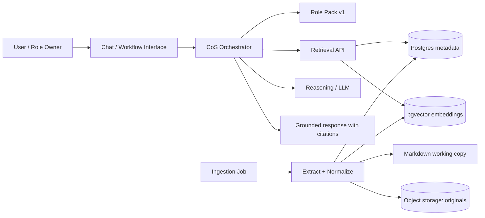
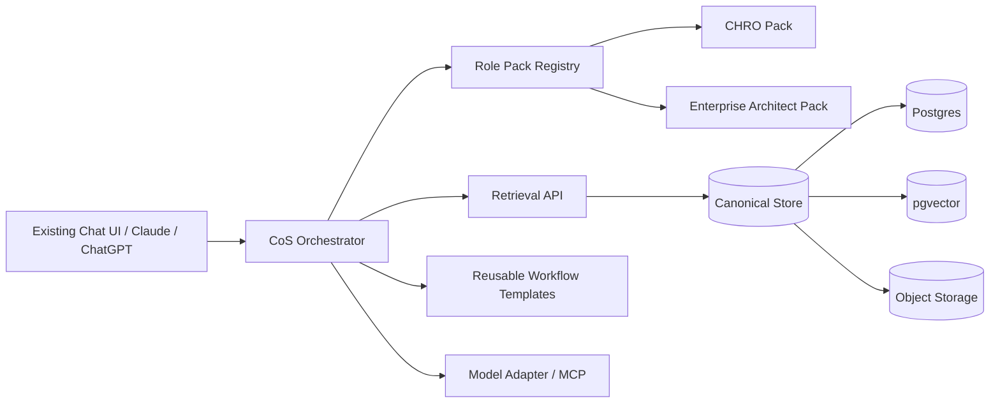
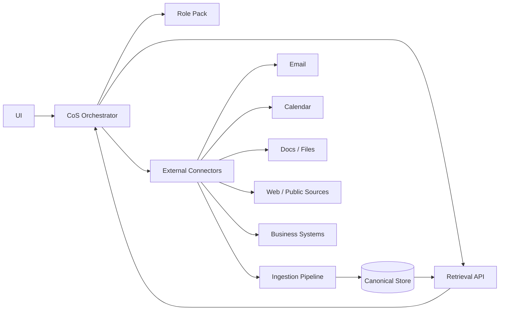
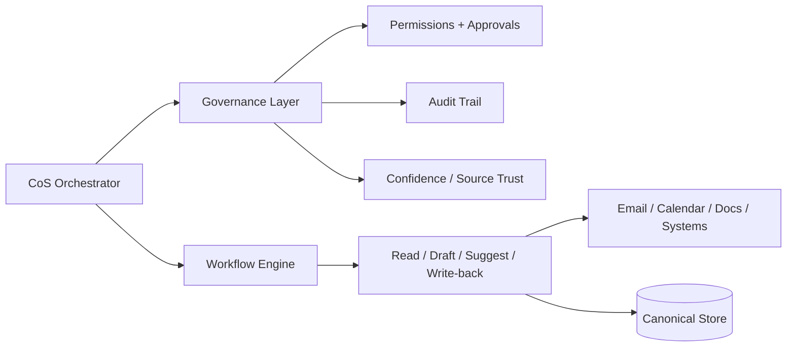
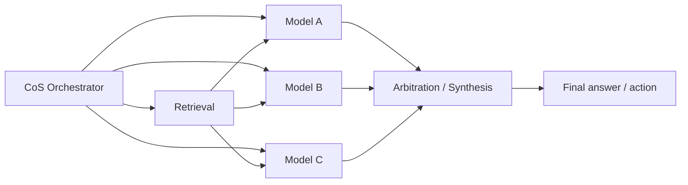
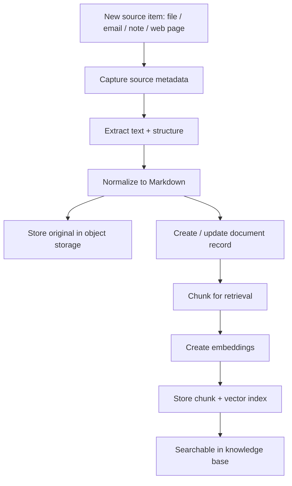
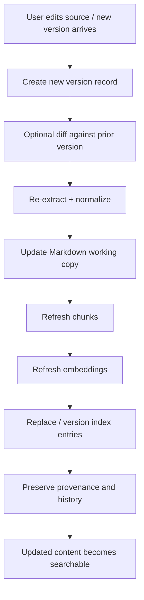
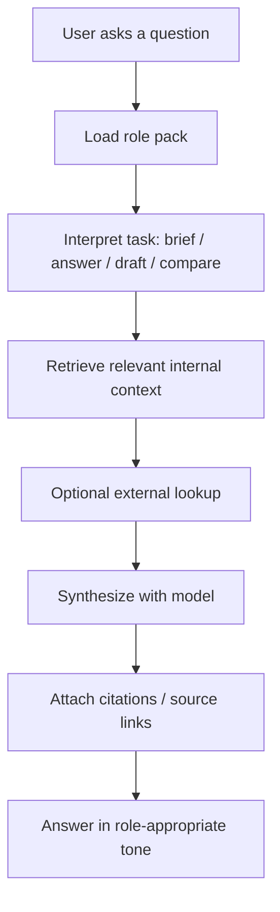
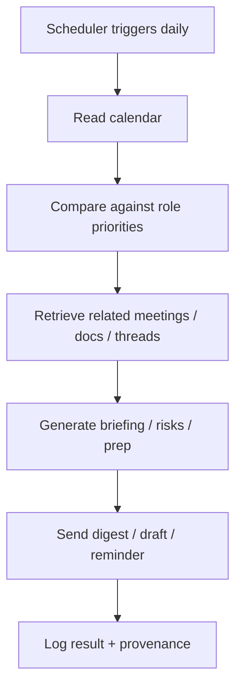
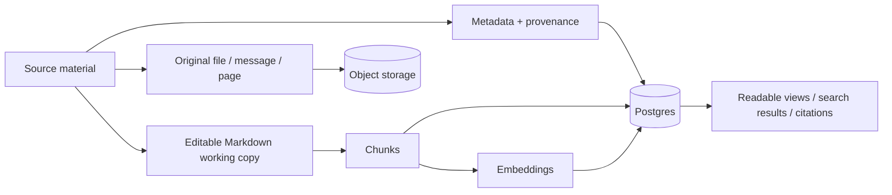

# Shared CoS Platform — Architecture Diagrams and Handoff Pack

This companion document contains:
- logical static architecture by phase
- dynamic flows for ingestion, read, and scheduled checks
- a compact handoff prompt that can be pasted into another chat to create an implementation plan with stories/tasks

---

## 1. Static Architecture by Phase

### Phase 1 — Shared Core MVP

### Phase 2 — Role Pack Abstraction

### Phase 3 — External Connectivity

### Phase 4 — Workflow and Governance Hardening

### Phase 5 — Advanced Reasoning

---

## 2. Dynamic Flows

### 2.1 Ingestion Flow — New Source

### 2.2 Ingestion Flow — Update / Re-ingest

### 2.3 Read Flow — Chat Query to Grounded Answer

### 2.4 Scheduled Task — Daily Calendar Check

---

## 3. What Gets Stored

Stored artefacts:
- original source files
- editable Markdown copies
- metadata records
- chunk records
- embeddings
- provenance / version history
- permissions and confidence tags
- workflow logs

---

## 4. Suggested Handoff Prompt for a New Chat

Paste the following into a fresh chat when you want implementation stories and tasks:

> You are helping implement a reusable Chief of Staff platform. Use the attached architecture spec and diagrams as the source of truth. Produce an implementation plan broken into epics, stories, and tasks. Start with Phase 1 only. Keep the design role-agnostic in the core platform and role-specific only in the role pack. Focus on supportability, provenance, editable Markdown source copies, Postgres + pgvector, and a simple retrieval-first workflow. Include acceptance criteria for each story and call out dependencies and risks. Do not introduce MemPalace, recursive LLMs, or multi-model arbitration unless explicitly asked.

---

## 5. Phase 1 Story Skeleton

For convenience, here is a starter breakdown for Phase 1:

- **Epic 1: Source ingestion**
  - upload or connect source documents
  - extract and normalize text
  - preserve originals and version history

- **Epic 2: Canonical storage**
  - document records
  - chunk records
  - metadata / provenance
  - pgvector embeddings

- **Epic 3: Retrieval API**
  - keyword search
  - semantic search
  - source filtering
  - citations

- **Epic 4: Role pack v1**
  - role profile
  - tone rules
  - workflow list
  - retrieval priorities

- **Epic 5: Read-only chat workflow**
  - grounded answer path
  - citations / links
  - safe fallback behavior

- **Epic 6: Daily calendar check**
  - scheduled job
  - relevant meeting retrieval
  - brief generation

---

## 6. Notes on Keeping It Simple

- Use one core platform.
- Keep role behavior in configuration, not code.
- Keep original content human-readable and editable.
- Make every generated answer trace back to source material.
- Add advanced reasoning later only if the Phase 1–4 system is already useful.

